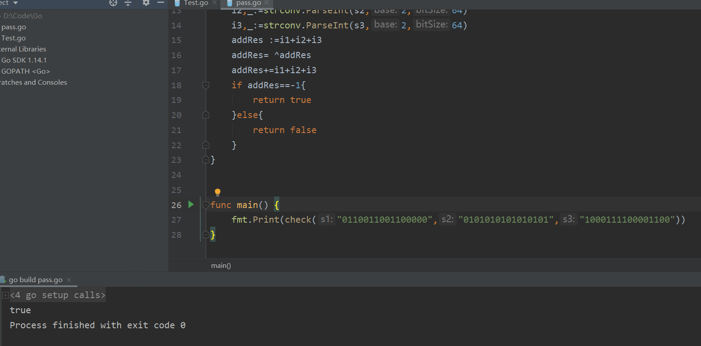

# 第五次作业

## go程序

因为python学了很久了，最近又在学go，所以用go来实现这个功能

思路大致为，首先检测输入都为16位二进制字符串，不是则返回false

其次二进制相加结果等于十进制相加，取反后要求全为1，对于十进制数实际上是-1，所以最后只需判断结果是否为-1即可，代码如下：

~~~go
package main

import (
	"fmt"
	"strconv"
)

func check(s1 string,s2 string,s3 string)bool{
	if len(s1)!=16 || len(s2)!=16 || len(s3)!=16{
		return false
	}
	i1,_:=strconv.ParseInt(s1,2,64)
	i2,_:=strconv.ParseInt(s2,2,64)
	i3,_:=strconv.ParseInt(s3,2,64)
	addRes :=i1+i2+i3
	addRes= ^addRes
	addRes+=i1+i2+i3
	if addRes==-1{
		return true
	}else{
		return false
	}
}

func main() {
	fmt.Print(check("0110011001100000","0101010101010101","1000111100001100"))
}
~~~

运行结果如下：

## 课后习题

### P3

> UDP和TCP使用反码来计算它们的检验和。假设你有下面3个8比特字节：01010011, 01100110, 01110100.这些8比特字节和的反码是多少？（注意到尽管UDP和TCP使用16比特的字来计算检验 和，但对于这个问题，你应该考虑8比特和。）写岀所有工作过程。UDP为什么要用该和的反码，即 为什么不直接使用该和呢？使用该反码方案，接收方如何检测出差错？ 1比特的差错将可能检测不出 来吗？ 2比特的差错呢？ 

将前两个字节相加得：

01010011+01100110=10111001

结果与第三个字节相加得

10111001+01110100=100101101

**最后结果反码为 011010010**

为了检测错误，接收方添加四个单词(三个原始单词和校验和)。如果和包含一个零，接收器知道有一个错误。所有的一位错误都会被检测到，但是两位错误可以不被检测到.

### P4

> a.假定你有下列2个字节：01011100和01100101这2个字节之和的反码是什么？
>
>  b. 假定你有下列2个字节：11011010和 01100101  这2个字节之和的反码是什么？ 
>
> c. 对于（a）中的字节，给出一个例子，使得这2个字节中的每一个都在一个比特反转时，其反码不 会改变。 

a. 01011100+01100101=11000001 

 **取反码为：00111110**

b. 11011010+ 01100101 =100111111

**取反码为：011000000**

c. 第一个字节为01010100；第二个字节为01101101。

其和为 11000001