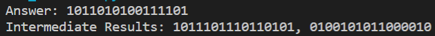
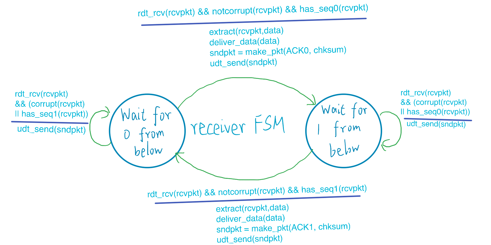

# 第三章

## 课件作业

根据要求编写可调用对象类UDPChecksum如下，其实例构造时可设置字长，调用时传入字符串列表，每个字符串表示一个字（默认为一个16位整数序列），调用结果为字符串表示的checksum，该可调用对象具有“history”数据对象，保存上一次计算的中间结果：

```python
from functools import reduce


class UDPChecksum(object):

    __slots__ = ['word_size', 'history']

    def __init__(self, word_size: int=16):
        self.word_size = word_size
        self.history = None

    def _check_word_size(self, word):
        assert len(word) == self.word_size, "期望字长为{}, 但输入字的长度为{}".format(self.word_size, len(word))

    def __call__(self, words: [str]) -> str:

        for w in words:
            self._check_word_size(w)

        self.history = []
        
        def single_step(word0: str, word1: str) -> str:

            num0 = eval("0b{}".format(word0))
            num1 = eval("0b{}".format(word1))
            result = num0 + num1

            mask = eval("0b{}".format("1" * self.word_size))
            result = (result & mask) + (result // (mask + 1))

            result = bin(result).split('b')[-1] # 去除二进制标识'0b'
            result = "{}{}".format('0' * (self.word_size - len(result)), result) # 补齐位宽
            self.history.append(result)

            return result

        return "".join(map(lambda x:'0' if x=='1' else '1', reduce(single_step, words))) # 最终结果取反


def main():
    
    sum_checker = UDPChecksum()
    words = ["0110011001100000",
             "0101010101010101",
             "1000111100001100"]
    print("Answer: {}".format(sum_checker(words)))
    print("Intermediate Results: {}".format(", ".join(sum_checker.history)))

if __name__ == "__main__":
    main()
```

利用该程序验证课本3.3.2节的计算，运行结果与课本一致：



## 课后习题

### P4

**a.**


**b.**


回卷后得到


**c.**

若反码不变，则加和结果不变，首先可考虑最简单的单纯加和（不回卷）的结果不变，比较容易想到的是：这两个字节在相同的位上互换bit值，例如01011101和01100100，交换bit于最低位。


可见，反码不会改变。

### P8

rdt3.0中的发送端FSM如下：



值得注意的是，相对于rdt2.2，rdt3.0仅在发送端添置了timeout事件、倒计时的时钟及其相应操作。故，rdt3.0中接收方的FSM和rdt2.2中的相同。

