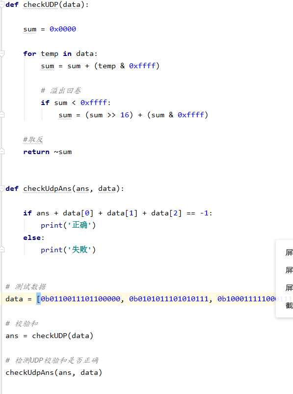

## UDP 十六位校驗和

##  第三章課後習題

> P2、假设主机A、B和C的IP地址分别为a、b、c。（请注意，a，b， c各不相同）。
>
> 主机A：源端口=80，源IP地址=b，DEST端口=26145，DESTIP地址=a
>
> 到主机C，左进程：源端口=80，源IP地址=b，DEST端口=7532，DESTIP 地址=c
>
> 到主机C，右进程：源端口=80，源IP地址=b，DEST端口=26145，DEST IP地址=c。

> a)将这两个字节相加得到11000001。取补码就等于00111110。
>
> b)把这两个字节相加，等于01000000；补码等于10111111。
>
> c)第一个字节=01010100；第二个字节=01101101。