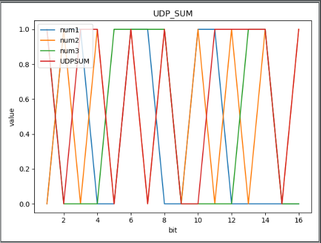
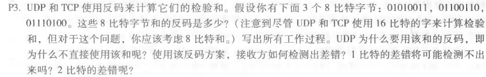
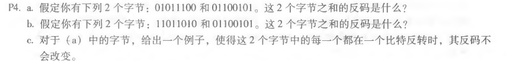

### 用 python 实现 UDP 的16位校验和，并用该程序验证课本3.3.2节的计算

python代码如下：

```
import numpy as np
from matplotlib import pyplot as plt
#获取UDP校验和
def get_sum(bit_list):
    sum=0
    for bit in bit_list:
        #超出16位直接返回
        if len(bit)>16:
            return
        sum+=int(bit,2)
        #回卷
        sum=(sum&0xffff)+((sum>>16)&0x1)
    #取反
    sum=sum^0xffff
    return sum

#画图
def showplt(bit_list,sum):
    plt.title("UDP_SUM")
    plt.xlabel("bit")
    plt.ylabel("value")
    #画出需要校验的数字的plt图
    for index in range(len(bit_list)):
        x = []
        y = []
        for i in range(16):
            x.append(i+1)
            y.append(int(bit_list[index][i]))
        plt.plot(x, y,label="num{0}".format(index+1))
    #画出UDP校验和的plt图
    x = []
    y = []
    for i in range(16):
        x.append(i + 1)
        y.append(int(sum[i]))
    plt.plot(x, y, label="UDPSUM")
    plt.legend(loc='upper left')
    plt.show()


if __name__=='__main__':
    list=["0110011001100000",
          "0101010101010101",
          "1000111100001100"]
    for i in range(len(list)):
        print("第{0}个校验数字为：{1}".format(i+1,list[i]))
    print("校验和为：{0}".format(np.binary_repr(get_sum(list),16)))
    showplt(list,str(np.binary_repr(get_sum(list),16)))
```

运行结果为：

```
第1个校验数字为：0110011001100000
第2个校验数字为：0101010101010101
第3个校验数字为：1000111100001100
校验和为：1011010100111101
```



---

### P3



  01010011

<u>+01100110</u>

   10111001

<u>+ 01110100</u>

 100101101 回卷

 00101110 取反

  11010001

使用反码的原因：不依赖于系统的大小端、计算方便。

如何检测：接收方将三个原始数据与校验和相加，和包含0则出错。

1比特可以，2比特不一定行（类似于负负得正）。

### P4



a. 01011100+01100101=11000001 反码为 00111110

b.11011010+01100101=100111111 反码为011000000

c.两个字节的最低位都发生反转，变成01011101和01100100

01011101+01100100=11000001 反码为00111110 未发生改变，也印证了P3的2比特差错不一定检测和出来。

