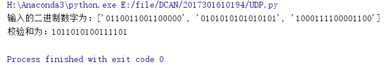
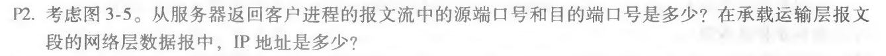
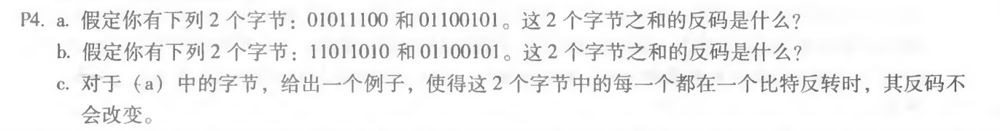

# 网络及分布式计算作业5

## UDP的16位校检和

~~~ python
import re

def udp(strs):
    #使用正则表达式判断
    assert (type(strs) == list) ,"输入参数必须为字符串列表"
    assert (len(list([s for s in strs if re.match("(0|1){16}",s) != None])) == len(strs)),"输入二进制串有误"
    res  = 0
    for s in strs:
        res += int(s,2)
        res = (res & 0xffff) + (res >> 16)
    res ^= 0xffff
    return bin(res).replace("0b","")

if __name__ == '__main__':
    input_strs = ["0110011001100000",
                     "0101010101010101",
                     "1000111100001100"]
    print("输入的二进制数字为："+str(input_strs))
    print("校验和为："+udp(input_strs))
~~~

## 运行结果

## 习题2

从 B 到 C：
   左边的连接：源端口号 80，源 IP 为 B 的 IP；目的端口 26145，目的 IP 为 C 的 IP；
   右边的连接：源端口号 80，源 IP 为 B 的 IP；目的端口 7532，目的 IP 为 C 的 IP；

从 B 到 A：
   源端口号 80，源 IP 为 B 的 IP；目的端口 26145，目的 IP 为 C 的 IP；

## 习题4

a. 00111110
b. 01000000
c. a 中的第一、二字节变为 01011101、01100100

## 作者

软五 2017301610194 马如云
