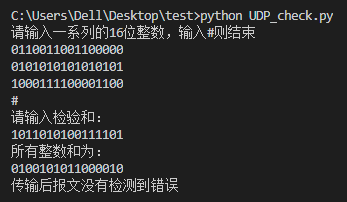
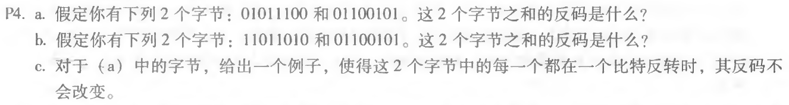
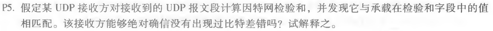

### 第五次作业

* * *

#### PPT上的题

>用python实现UDP的16位校验和，并用该程序验证课本3.3.2节的计算。

　　实现的程序逻辑是，输入一系列的16位二进制整数存在一个列表里，再输入校验和。对列表里的每一个整数进行相加，若溢出则进行回卷，计算出它们的和，然后将和与校验和相加，若等于0xffff则无错误，若不等于则检测到错误。
　　另外，认为完全没有matplotlib可以用到的地方，所以程序中没有使用matplotlib。

python程序如下：
```python
num_list = []
print('请输入一系列的16位整数，输入#则结束')
num = input()
while num != '#':
    num_list.append(int('0b' + num, 2))
    num = input()
check_sum = int('0b' + input('请输入检验和：\n'), 2)

sum = 0
for n in num_list:
    sum += n
    sum = (sum & 0xffff) + (sum >> 16)
print('所有整数和为：')
print(bin(sum).replace('0b','').rjust(16,'0'))
if (sum + check_sum) ^ 0xffff == 0:
    print('传输后报文没有检测到错误')
else:
    print('传输后报文检测到错误')
```

验证课本3.3.2节的计算：


* * *

#### P4

##### 题目：


##### 作答：
a.字节01011100和01100101，这两个字节的和为11000001，其反码为00111110。

b.字节11011010和01100101，这两个字节的和为01000000，其反码为10111111。

c.将第一个字节反转为01010100，第二个字节反转为01101101，则它们的和不变，和的反码也不变。

* * *

#### P5

##### 题目：


##### 作答：
　　不能，接收方不能绝对确信没有出现任何位错误。由于校验和方式的局限，比如说包中有两个16位字相加之后的和有两个位是0和1，那么这两个位分别发生错误而翻转到1和0，这两个字的和仍然保持不变。此时，接收方计算的反码也是相同的。这说明，即使存在传输错误，校验和也有可能验证不出错误。

* * *
