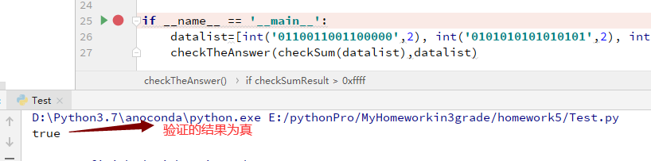
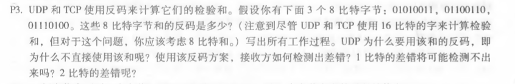

# 作业五

​						*马克*

#### 第一题：用python验证UDP16位校验码并用这个程序验证计算机网络（自顶向下）课本3.3.2节的计算。

验证程序见./test.py，运行结果截图如下：

#### 第二题计算机网络课本第三章习题练习（p207起）

###### 1，p1

答：假定 A 向 S 的源端口号为 x， B 向 S 的源端口号为 y
a.A 向 S 的源端口号为 x， 目的端口号为 23

b.B 向 S 的源端口号为 y， 目的端口号为 23

c.S 向 A 的源端口号为 23， 目的端口号为 x

d.S 向 B 的源端口号为 23， 目的端口号为 y

e.x y 可能相同

f.x,y不相同

###### 2，p3

  答：01010011+01100110=10111001

  		10111001+01110100=1 00101101

反卷：00101110——>求反码：11010001

使用反码有以下好处：

1. 不依赖系统是大端还是小端
2. 计算校验和比较简单快速

接收方将所有字节与校验和相加，结果每一位全为1

1bit错误能检测出，2bits可能检测不出：可能恰好两个字节对应位发生反转。

###### 文末的话

如果您读到这里发现我的文章中有错误或者您有什么更好的建议方法等，希望您能给我留言，非常感谢。