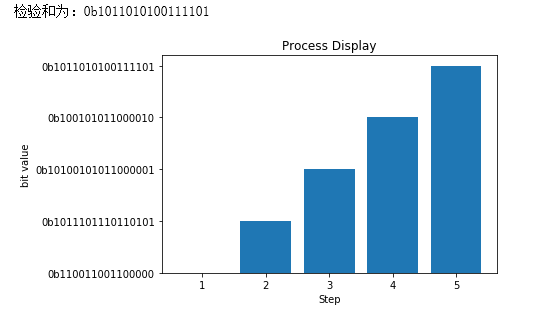

# 网络及分布式计算-Homework5

2017302580026 郑慧                          2020年3月30日

**Python实现UDP16位校验和，并验证课本3.3.2**

UDP16位校验和的代码逻辑为：

1. 二进制每16位相加得到32位结果；

2. 若32位的高16位不为0，则将高16位与低16位相加，得到32位结果；
3. 重复步骤2直到高16位为0，取反得到检验和。

并且在编码过程中，使用matplotlib绘制出得出结果的每个步骤

主要代码如下（源代码文件check.py见上一级目录）：

```python
from matplotlib import pyplot as plt 

def check_draw(data):
    sum = 0
    x = []                            #x轴，代表步骤N
    y = []                            #y轴，代表中间或最终结果
    for i in range(0,len(data),4):
        val = int(data[i:i+4],16)
        sum = sum + val
        y.append(bin(sum))             #绘图使用
        
    while sum > 0xffff:
        sum = (sum>>16)+(sum&0xffff)
        y.append(bin(sum))             #绘图使用
    res = sum^0xffff
    y.append(bin(res))                 #绘图使用
   
    #绘图
    for i in range(1,len(y)+1):
        x.append(i)
    plt.title("Process Display") 
    plt.xlabel("Step") 
    plt.ylabel("bit value")
    plt.bar(x, y)
    
    return bin(res)
```

验证课本3.3.2代码及结果如下：

```python
a = '666055558f0c'
print("检验和为：" + (check_draw(a)))
```




**第三章课后题2道**

*P3.*

* 结果为11010001，计算过程如下：

```
  01010011
+ 01100110
____________
  10111001
  
  10111001
+ 01110100
____________
1 00101101
 
  00101101
+        1
____________
  00101110 
  
~(00101110) = 11010001
```

* 使用该和反码的原因为：不依赖系统是大端或小端；无论你是发送方计算机或者接收方检查校验和时，都不要调用htons或者ntohs并且计算实现简单。

* 检测出错的方案为：在接收方中，将全部的的字包含校验和，加在一起，若没有出错，应该全部为1，若出现0说明出错。 

* 1比特的出错不可能检测不出来。
* 2比特的出错可能检测不出来，如原题目中的前两个数01010011和01100110的最后一位互换，即为01010010和01100111，此时出现了2比特错误，但是对结果没有影响，无法检测出错误。


*P12.*

该协议能够正常工作，原因为重传是在分组丢失的情况下发生的，所以该协议还是能够正常工作。但是分组丢失也可能是由于定时器过早超时导致的，在此情况下，发送方每收到一个ACK都会发送分组，每一个超时重发的分组都将会导致正在发送的包重发，当n趋向于无穷时，分组发送的次数将趋于无穷。