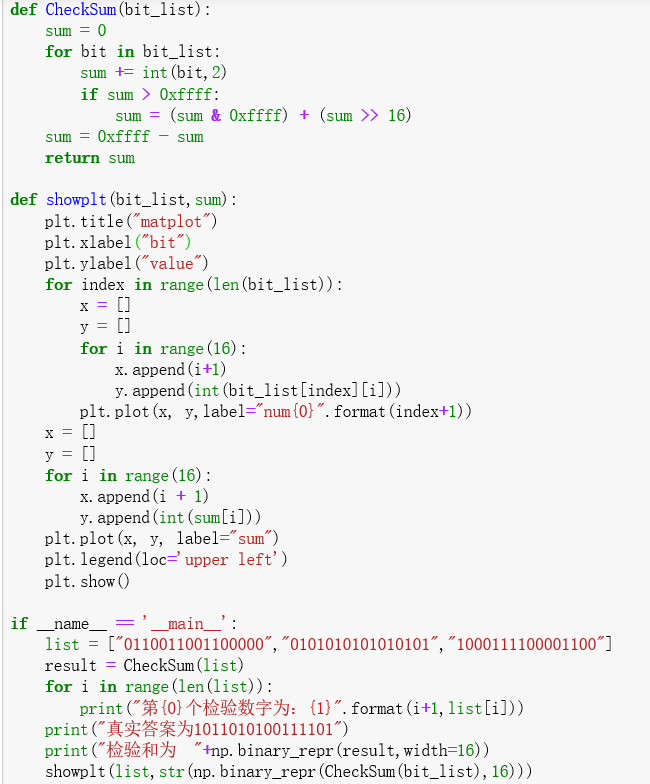
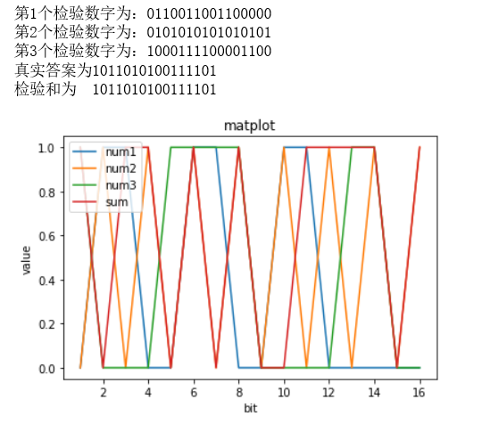
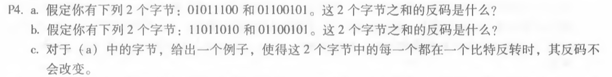
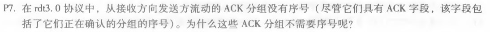

# 网络及分布式计算第五次作业

计算机学院-刁可 -2017302580031

1. 用python实现UDP的16位校验和，并用该程序验证课本计算

   验证结果相同

   

2. P4

 a、01011100+01100101= 11000001 

反码为：00111110

 b、11011010+01100101= 01000000

 反码为： 10111111

 c、第一、二字节变为 01011101、01100100

3. P7

   

   因为是停等协议，只要在当前位置重传即可，不需要表明序号（也就是数据在字节流中的起始位置），接收方、发送方都不需要该序号。