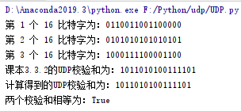
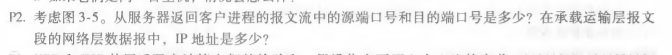
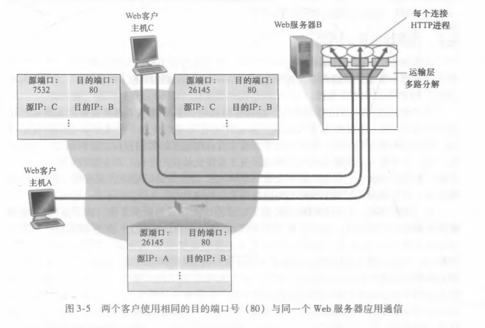
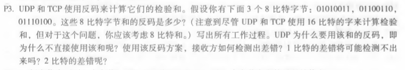

### 实验题：计算UDP的16位校验和
- **实验步骤**
  - 编写get_check函数获取校验和
    - 对3个16比特字依次进行二进制相加
    - 对相加得到的结果进行回卷运算
    - 再对结果求反即可
  - 学习matplotlib的用法，编写绘制图表函数
  - 调用这两个函数，验证课本的3.3.2节的计算

- **实验代码(源文件位于"./UDPChecksum.py")**

```python
import numpy as np
from matplotlib import pyplot as plt


# 计算UDP校验和
def get_checksum(bit_list):
    checksum = 0
    for bit in bit_list:
        # UDP使用16比特的字来计算校验和
        if len(bit) != 16:
            print("输入数据出错，不是每个字的长度都为16比特！")
            return
        # 将二进制16比特字的字符串转化为int再求和
        checksum += int(bit, 2)
        # 回卷运算
        checksum = (checksum & 0xffff)+((checksum >> 16) & 0x1)
    # 取反
    checksum = checksum ^ 0xffff
    return checksum


# 绘制图表
def plot(bit_list, checksum):
    plt.xlabel("bit_position")
    plt.ylabel("value")
    for i in range(len(bit_list)):
        x = []
        y = []
        for j in range(16):
            x.append(j)
            y.append(int(bit_list[i][j]))
        plt.plot(x, y,label="bit_number" + str(i + 1))
    x = []
    y = []
    for i in range(16):
        x.append(i + 1)
        y.append(int(checksum[i]))
    plt.plot(x, y, label="checksum")
    plt.legend(loc='right')
    plt.show()


if __name__ == '__main__':
    test_list = ["0110011001100000", "0101010101010101", "1000111100001100"]
    origin_checksum = "1011010100111101"
    computed_checksum = np.binary_repr(get_checksum(test_list), 16)
    for index in range(len(test_list)):
        print("第 {0} 个 16 比特字为：{1}".format(index + 1, test_list[index]))
    print("课本3.3.2的UDP校验和为："+ origin_checksum)
    print("计算得到的UDP校验和为："+ computed_checksum)
    print("两个校验和相等为：{0}".format(origin_checksum == computed_checksum))
    plot(test_list, str(computed_checksum))

```

- **实验结果**

  - 控制台输出

    

  - plot图表

    

******

### 课后练习

- ***P2***

  

  解答：

  - 已知：
    - 图3-5如下所示：

    

    - 由对图3-5的说明可以知道：主机A与主机C及服务器B都有自己唯一的IP地址，它们分别是A、C、B。

  - 故而答案如下：

    - 服务器返回主机A：源端口=80，源IP地址= B, 目的端口= 26145,目的IP地址= A
    - 服务器返回主机C的左进程：源端口=80，源IP地址= B, 目的端口= 7532,目的IP地址= C
    - 服务器返回主机C的右进程：源端口=80，源IP地址= B, 目的端口= 26145,目的 P地址= C

- ***P3***

  

  解答：

  - 求和的反码：
    - 01010011 + 01100110 = 10111001
    - 10111001 + 01110100 = 1 00101101
    - 1 00101101进行回卷运算得到：00101110
    - 00101110取反得到：11010001
  - 使用反码的原因：
    - 不拘泥于系统的大端、小端
    - 能够快速计算校验和
  - 如何检测：将三个字节和校验和全部相加，得到的结果如果有任何一个位是0就表示出错了
  - 1比特的差错不可能检测不出
  - 2比特的差错有可能检测不出，比如在相加的时候某两个字节的同一位分别为0和1，然后误操作将0和1互换位置，那么就有2比特的差错，但是结果依然正确，故没有检测出错误

  

