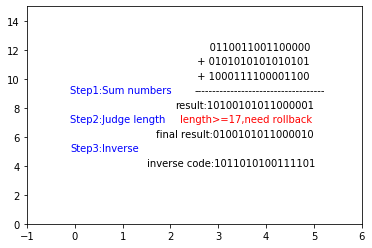

#### 编程题：

详见 2017302580043.ipynb

```python
# -*- coding:utf-8 -*-
import matplotlib.pyplot as plt

def judge(str_input):
    c = "0"
    for str_ in str_input:
        c = bin(int(c, 2) + int(str_, 2))
#     print(c)  # type:str like "0bxxxx"
    result = c[2:];
#     print(result);  #  type:str like "xxxx"
    len_ = len(str_input)
    
    plt.text(2.5, n - len_ -1, "-"*36);
    plt.text(-0.1, n - len_ -1, "Step1:Sum numbers", color='blue');
    plt.text(2.1, n - len_ -2, "result:" + str(result));

    # len > 17，rollback
    length = len(result);
    plt.text(-0.1, n - len_ -3, "Step2:Judge length", color='blue');
    while (length >= 17):
        plt.text(2.2, n - len_ -3, "length>=17,need rollback", color='red');
        tmp_result = result[1:];
        tmp_num = int(str(tmp_result), 2);
        add_num = int("1", 2);
        tmp_result = bin(tmp_num + add_num)[2:];
        length = len(tmp_result);
        result = tmp_result;
    # len < 16，add 0
    while length < 16:
        final_str = "0" + str(result);
        length = length + 1;
        
    plt.text(1.7, n - len_ -4, "final result:"+final_str);
    # inverse here
    com_str = "";
    for f in final_str:
        if (int(f) == 0):
            com_str = com_str + "1";
        else:
            com_str = com_str + "0";
    plt.text(-0.1, n - len_ -5, "Step3:Inverse", color='blue');
    plt.text(1.5, n - len_ -6, "inverse code:" + com_str);


if __name__ == "__main__":
    # input, you can change the fixd data to console input here if needed
    str_input = ["0110011001100000", "0101010101010101", "1000111100001100"]
    
    plt.figure();
    plt.xlim(-1, 6)
    plt.ylim(0, 15)
    n=13;
    
    plt.text(2.5, n-1, "     " + str_input[0])
    for i in range(1, len(str_input)):
        plt.text(2.5, n-i-1, " + " + str_input[i])

    judge(str_input);
    plt.show();
```



#### P3：

1. 0101 0011+0110 0110 = 1011 1001

   1011 1001+0111 0100 = 1 0010 1101

   字节和的反码为1101 0001

   因为使用反码的话：1. 不依赖系统是大端还是小端，2.计算检验和比较简单快速

2. 接收方将三个字节与检验和相加，如果和含零则证明出错。

3. 1个比特的差错一定会被检查出来

4. 2个比特的差错可能不被检查出来。比如：第一个字节变为 0101 0010，第二个字节变为0110 0111，最后字节和的反码为1101 0001不变。

#### P4：

a. 0101 1100+0110 0101= 1100 0001

​	反码：0011 1110

b.1101 1010+ 0110 0101 =1 0011 1111

​	反码：1011 1111

c. 0101 1100变为：0101 1101

​	0110 0101变为：0110 0100