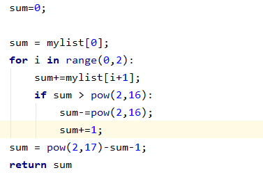

# homework5

代码见附件

校验和为：1011010100111101

获取校验和的方法如下

1.将两个数字相加，若大于216则回卷，-216+1

2.重复1，直到把三个数字加在一起

3.最终用217-sum-1来取反

---

P2

从 B 到 C：
   左边的连接：源端口号 80，源 IP 为 B 的 IP；目的端口 26145，目的 IP 为 C 的 IP；
   右边的连接：源端口号 80，源 IP 为 B 的 IP；目的端口 7532，目的 IP 为 C 的 IP；
从 B 到 A：
   源端口号 80，源 IP 为 B 的 IP；目的端口 26145，目的 IP 为 C 的 IP；

P4

**a.**  00111110

**b.**  01000000

**c.**  a 中的第一、二字节变为 01011101、01100100
