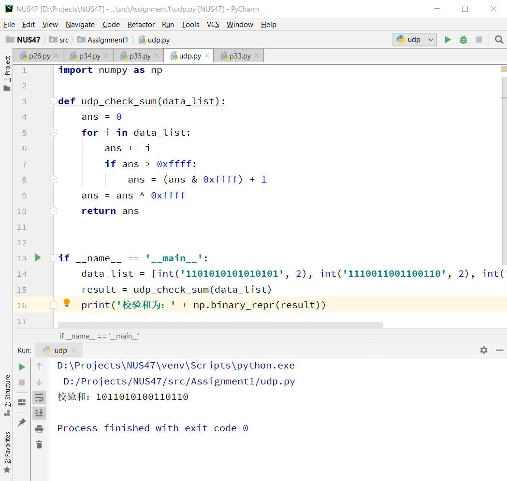

### 2017302580107-肖敏-homework5
1. **UDP校验和计算-Python**
    - UDP检验和算法
    ```.env
   UDP的校验和需要计算UDP首部加数据荷载部分，但也需要加上UDP伪首部。
   这个伪首部指，源地址、目的地址、UDP数据长度、协议类型（0x11），协议类型就一个字节，但需要补一个字节的0x0，构成12个字节。
   伪首部+UDP首部+数据 一起计算校验和。
   
   UDP检验和的计算方法是：
    a. 按每16位求和得出一个32位的数；
    b. 如果这个32位的数，高16位不为0，则高16位加低16位再得到一个32位的数；
    c. 重复第2步直到高16位为0，将低16位取反，得到校验和。
    ```
    - 实验代码
    ```.env
    import numpy as np
    
    def udp_check_sum(data_list):
        ans = 0
        for i in data_list:
            ans += i
            if ans > 0xffff:
                ans = (ans & 0xffff) + 1
        ans = ans ^ 0xffff
        return ans
    
    
    if __name__ == '__main__':
        data_list = [int('1101010101010101', 2), int('1110011001100110', 2), int('1000111100001100', 2)]
        result = udp_check_sum(data_list)
        print('校验和为：' + np.binary_repr(result))
    ```
   - 运行结果
   
   
2. **课后习题**
    - p3
    ```.env
    	01010011
    +	01100110
    ---------------
    	10111001
    +	01110100
    ---------------
        00101110(回卷)
    ~	11010001（求反）
   接收方带四个数据 (三个原始数据和校验和)，如果校验和包含一个零则代表出错，
   所有的一位错误都会被检测到，但是两位错误可以不被检测到  
    ```
   - p4
   ```.env
    a.     01011100
       +	01100101
       ---------------
        	11000001
       ~	00111110（求反）  
    
    b.      11011010
      +     01100101
      ---------------
            100111111
      ~     011000000（求反） 
    
    c       01010100
      +     01101101  
      ---------------
            11000001
   ```
   