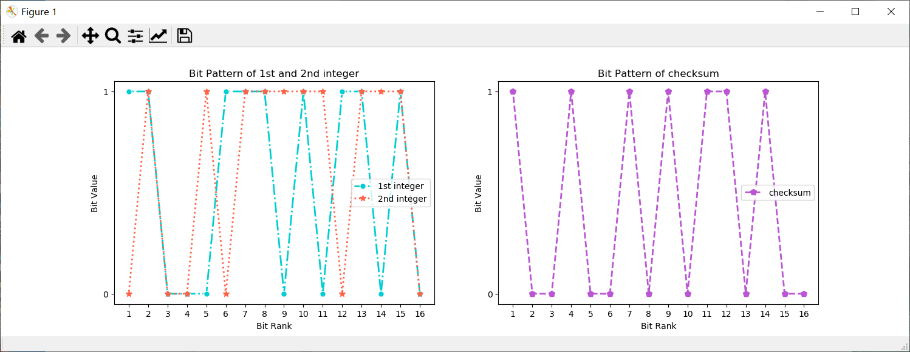
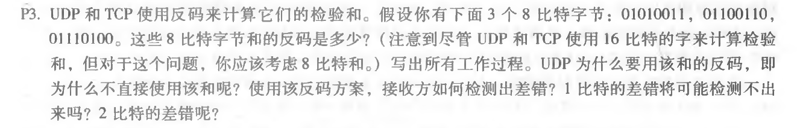
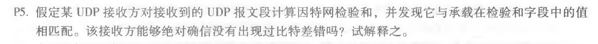

# 第5次作业

+ 编写python程序计算checksum，并可视化。步骤（以两个16位整数为例）：

  1. 将两个整数转为二进制相加，若最高位产生进位，转到步骤2；若不产生进位，转到步骤3；
  2. 将进位的数值回卷，加回到最低位；
  3. 对上述产生的和进行取反码操作，得到校验和；
  4. 利用*matplotlib*中的*pyplot*进行绘图，表示出两个十六进制整数和校验和的位模式。

  具体代码如下：

  ```python
  import random
  import matplotlib.pyplot as plt
  import numpy as np
  
  #用于计算两个十六进制整数的校验和
  def compute_checksum():
  	#随机生成两个十六进制整数，实际映射为-2^15 ~ 2^15 - 1
  	lower_limit = -2**15
  	upper_limit = 2**15 - 1
  	integer_1 = random.randint(lower_limit, upper_limit)
  	integer_2 = random.randint(lower_limit, upper_limit)
  	initial_sum = integer_1 + integer_2
  	##模拟回卷：若超过16位，则回卷
  	if(initial_sum > upper_limit):
  		initial_sum = initial_sum - 2**15 + 1 ##去掉首位，并加回个位
  	checksum = initial_sum
  	#和如果是负数，还需要取补码（因为python中的负数输出二进制表示不是补码形式），并且求反
  	if(checksum < 0):
  		checksum = (checksum & 0xffff)
  	return [integer_1, integer_2, bin(checksum).replace("0b", "").replace("0", "a").replace("1", "0").replace("a", "1")]
  
  #用于将一个整数转为Bit列表
  def transform_integer_into_bit_list(integer):
  	cpl_code = integer
  	if(integer < 0):
  		cpl_code = cpl_code & 0xffff
  	bit_list = list(bin(cpl_code).replace("0b", ""))
  	if len(bit_list) < 16:
  		for i in range(0, 16 - len(bit_list)):
  			bit_list.insert(0, '0') #补全高位的0
  	return bit_list
  
  #用于绘制位模式图
  def plot_illustration():
  	[integer_1, integer_2, checksum] = compute_checksum()
  	#绘制两个子图，第一张图显示两个整数的位信息，第二张图显示最后的checksum信息，折线图表示
  	fig = plt.figure()
  	x_axis = [16,15,14,13,12,11,10,9,8,7,6,5,4,3,2,1]
  	int_1_bit_list = transform_integer_into_bit_list(integer_1)
  	int_2_bit_list = transform_integer_into_bit_list(integer_2)
  	checksum_list = list(checksum)
      #补全高位的0
  	if len(checksum_list) < 16:
  		for i in range(0, 16 - len(checksum_list)):
  			checksum_list.insert(0, '0') 
  
  	ax_1 = fig.add_subplot(121)
  	ax_1.plot(x_axis, int_1_bit_list,c='#00CED1',marker='o',markeredgewidth=1,markeredgecolor='w',linestyle='-.',  linewidth=2, markersize=7, label="1st integer",)
  	ax_1.plot(x_axis, int_2_bit_list,c='#FF6347',marker='*',linestyle=':',  linewidth=2, markersize=7, label="2nd integer")
  	ax_1.set_xticks(x_axis)
  	ax_1.set_xlabel('Bit Rank')
  	ax_1.set_ylabel('Bit Value')
  	ax_1.set_title("Bit Pattern of 1st and 2nd integer")
  	leg = plt.legend()
  	ax_2 = fig.add_subplot(122)
  	ax_2.plot(x_axis, checksum_list,  c='#BA55D3',marker='p',linestyle='--',  linewidth=2, markersize=7, label="checksum")
  	ax_2.set_xticks(x_axis)
  	ax_2.set_xlabel('Bit Rank')
  	ax_2.set_ylabel('Bit Value')
  	ax_2.set_title("Bit Pattern of checksum")
  	leg = plt.legend()
  	plt.show()
  
  #执行函数
  plot_illustration()
  ```

执行效果：




+ 第三章课后习题任选两道题：

  + P3

    

    ```
     01010011
    +01100110
    _____________
     10111001 
     
     10111001
    +01110100
    _____________
    100101101
    最高位溢出，所以回卷：
    00101110
    取反码：
    11010001
    ```

    之所以要用反码而非原码的方式计算校验和，我觉得可能主要是为了在不同的端系统上都可以使用，比如有的端是*Big-Endian*,有的是*Little-Endian*。使用反码可以使得这两种情况下计算出的校验和都相等。

    接收方将所有字段（包括校验和字段）计算校验和，如果不为0，则说明出现了错误。因为校验和在发送端计算的是其他字段整数和的反码，而在接收端时，原码+反码=1111....1 ，求反之后就为0。

    1比特错误都可以被检测到，但2比特的可能不被检测到。

  + P5
  
    
  
    不能绝对确信，因为如果在发送端有两个16进制整数，只要它们同一位的和不变，比如1和0，变成0和1，这一位上二者的和都为1，校验和无法检验出来。所以校验和的作用可以描述为：当接收端计算校验和与传送过来的不一样，说明肯定出错了；但是如果是一样，也有可能出错。
