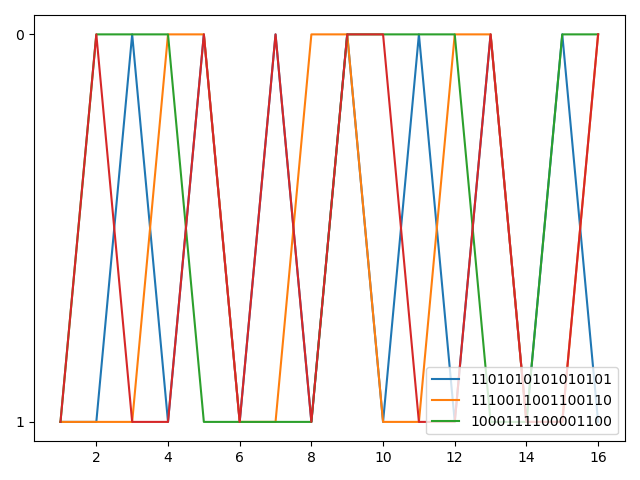

### 张佳乐 2017302580112 homework5

参考链接：

计算UDP的16位校检和：https://stackoverflow.com/questions/1767910/checksum-udp-calculation-python

matplotlib用法：https://www.runoob.com/w3cnote/matplotlib-tutorial.html

##### 1.计算UDP的16位校检和——Python实现

- 代码：

``` UDP_check.py
import numpy
from matplotlib import pyplot


def checksum_udp(udp_list):
    """
    UDP的16位校检和
    :param udp_list: 待校检16字数组
    :return: 校检和
    """
    check_sum = 0b0                                     # 二进制的0
    for i in udp_list:                                  # 将udp_list中的16字数依次相加
        i_to_binary = int(i, 2)
        check_sum += i_to_binary
        if check_sum > 0xffff:                          # 溢出的话回卷
            check_sum = (check_sum & 0xffff) + 1
    check_sum = numpy.binary_repr(check_sum ^ 0xffff)   # 取反
    return check_sum


# 实现书上3.3.2的例子
data = [
    '1101010101010101',
    '1110011001100110',
    '1000111100001100'
]
checksum = checksum_udp(data)
print('校验和为：' + checksum)

# 开始用matplotlib画图
x = range(1, 17)
for i in data:                                          # 分别绘制data中的数组
    pyplot.plot(x, list(i), label=i)
pyplot.plot(x, list(checksum))                          # 绘制结果
pyplot.legend(loc="lower right")                        # 展示标签
pyplot.show()                                           # 展示图片

```

- 结果图片：



##### P3. UDP和TCP使用反码来计算它们的检验和。假设你有下面3个8比特字节：01010011, 01100110, 01110100.这些8比特字节和的反码是多少？（注意到尽管UDP和TCP使用16比特的字来计算检验和，但对于这个问题，你应该考虑8比特和。）写岀所有工作过程。UDP为什么要用该和的反码，即为什么不直接使用该和呢？使用该反码方案，接收方如何检测出差错？ 1比特的差错将可能检测不出来吗？ 2比特的差错呢？

答：计算过程是：
```
    01010011
+   01100110
————————————
    10111001
+   01110100
————————————
(1) 00101101
+          1
————————————
    00101110
```

取反码为：11010001

好处是可以摆脱系统大端或者小端的局限，计算校检和也比较简单快速

检验差错的办法是将三个字节和校检码相加，如果所有位是1则正确，出现0则错误

1比特的差错肯定可以检测出来，2比特不一定，比如将第一第二字节中最后一位互换，结果依然正确

##### P5.假定某UDP接收方对接收到的UDP报文段计算因特网检验和，并发现它与承载在检验和字段中的值相匹配。该接收方能够绝对确信没有出现过比特差错吗？试解释之。

不能确信，接收方不能绝对确定是否没有发生位错误。这是因为如P3所述，如果数据包中某两个16位字的对应位不同（为0和1），传输过程中这两位正好出错。这时候接收方计算的反码依然相同。所以有时候传输出现错误，但校验和依然匹配。
