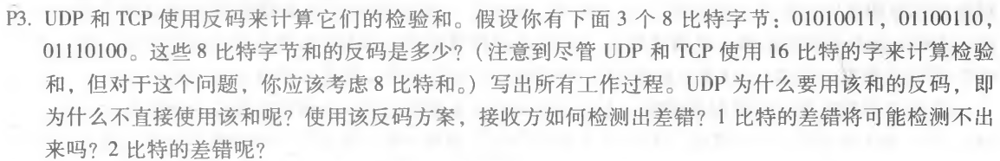
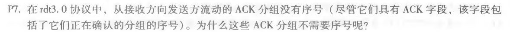

# Table of Contents

  * [一、用python实现UDP校验和检验](#一用python实现udp校验和检验)
  * [二、p3](#二p3)
  * [三、p7](#三p7)


## 一、用python实现UDP校验和检验

> 实验步骤：
>
> ①传入一个16位整数数组
>
> ②每个数加起来，当和溢出时，回卷
>
> ③将所有数的和求反，这个值就是校验和
>
> ④验证校验和的正确性：校验和+所有16位整数 = -1

```python
"""
    @author: xsy
    @date: 2020/3/28
    @desc: UDP校验和
"""

# 计算·udp校验和（_data是一个16位整数的数组）
def calculate_udp_sum(_data):
    _sum = 0x0
    for d in _data:
        _sum = _sum + (d & 0xffff)
        # 溢出回卷
        if _sum < 0xffff:
            _sum = (_sum >> 16) + (_sum & 0xffff)
    # 取反
    return ~_sum


def check_ans(_ans, _data):
    if ans + data[0] + data[1] + data[2] == -1:
        print('校验结果正确')
    else:
        print('校验结果失败')


# 测试数据
data = [0b0110011001100000, 0b0101010101010101, 0b1000111100001100]

# 校验和
ans = calculate_udp_sum(data)

# 检测UDP校验和是否正确
check_ans(ans, data)
```


## 二、p3



```
	01010011
+	01100110
---------------
	10111001
+	01110100
---------------
    00101110(此处有回卷)
~	11010001（求反）

接收方通过将这3个8比特字节和，和校验和进行相加，如果和包含一个零，接收方知道有一个错误。所有的1比特错误都会被检测到，但是2比特的差错可能不会被检测到（比如第一个单词的最后1位从1变成0，第二个单词的最后一位从0变成1）
```


## 三、p7



```
发送方一旦接收到了ACK，就会进入到下一个状态，会发送下一个分组，如果有重复的ACK，则会被忽略。
```

