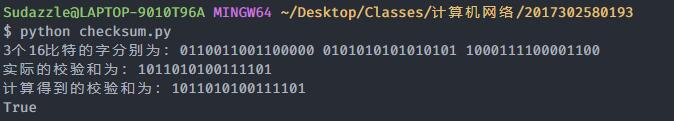

## 分布式与网络课程作业五

### python 实现 UDP 的 16 位校验和:
代码：
```
import numpy as np

def getChecksum(data_bits: list) -> int:
    res = 0
    for bit_word in data_bits:
        res += bit_word
        if res > 0xffff:
            res = (res % (1 << 16)) + (res >> 16)
    res = np.invert(res)
    return res

if __name__ == '__main__':
    data_bits = [int("0110011001100000", 2), int("0101010101010101", 2), int("1000111100001100", 2)]
    checksum = getChecksum(data_bits)
    print("3个16比特的字分别为：" + "0110011001100000 " + "0101010101010101 " + "1000111100001100")
    print("实际的校验和为：" + "1011010100111101")
    print("计算得到的校验和为：" + np.binary_repr(checksum, width = 16))
    print("1011010100111101" == np.binary_repr(checksum, width = 16))
```

运行结果：



### P15:
发送一个分组进入链路的时间 `D_trans = L/R = 12000bit/pkt ÷ 10^9bit/s = 0.012ms/pkt`
利用率 `U_sender = N*L/R ÷ L/R+RTT = N*0.012 ÷ 30.012 >= 0.9`
因此，窗口长度 `N >= 2251` 时，才能使该信道的利用率超过 90%


### P22:
a) 如果之前的 ACK 都已被由发送方接收，则窗口内的报文序号是 `[k, k+3]`；如果发送方未收到之前的 ACK，则窗口内的序号为 `[k-4, k-1]`。因此序号可能是 `[k-4, k+3]`。

b) 接收方期待的下一个有序分组的序号是 k，说明接收方已经接受到了序号 k-1 的分组，因此，ACK 字段的所有可能值为 `[k-4, k-1]`。
