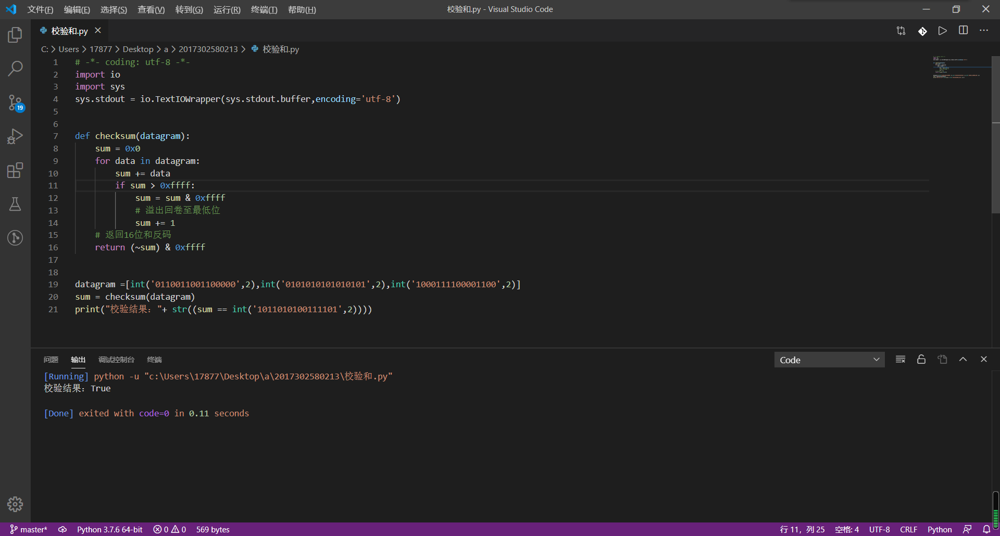

# 作业五

### 2017302580213 彭英杰 软工五班

--------------------------------------------------

> ## P3
>
> ~~~
>     01010011
>  +  01100110
>  =  10111001
>  +  01110100
>  = 100101101  
>  产生进位时回卷
>  最终结果为：
>  	00101110
> ~~~
>
> 反码是00101110
>
> UDP使用该和反码的原因：不依赖系统是大端小端。举个例子，用反码求和时，交换16位数的字节顺序，得到的结果相同，只是字节顺序相应地也交换了；而如果使用原码或者补码求和，得到的结果可能就不同。
>
> 接收方检验差错的方法是将三个字节与检验和相加，如果任何一个位为 0，说明出错
>
> 1比特的差错会导致结果不同
> 2比特的差错可能会检测不出，一增一减抵消。
------------------

> ## P6
>
> 如果 rdt2.1 发送方正处于“等待来自上层的调用0”，接收方处于“等待来自下层的0”，发送方发送序号为 0 的分组，而接收方正确接收并向发送方发送 ACK；此时发送方处于“等待 ACK 或 NAK 0”，接收方处于“等待下层的 1”，如果此 ACK 损坏，发送方重发序号0的分组，而接收方会发送 NAK，这将导致一个死循环

----------

> ## UDP16位校验和实现
>
> 用户数据报UDP有两个字段：数据字段和首部字段。首部字段很简单，只有8个字节，有四个字段组成，每个字段的长度都是两字节。各段意义如下：
>
> 1. 源端口：源端口号。在需要对方回信时选用。不需要时可用全0。
> 2. 目的端口：目的端口号。这在终点交付报文时必须要使用到。
> 3. 长度：UDP用户数据报的长度，其最小值是8（仅首部）。
> 4. 校验和：检测UDP用户数据报在传输中是否有错。有错就丢弃。
>
> UDP的校验和需要计算UDP首部加数据荷载部分，但也需要加上UDP伪首部。这个伪首部指，源地址、目的地址、UDP数据长度、协议类型（0x11），协议类型就一个字节，但需要补一个字节的0x0，构成12个字节。伪首部+UDP首部+数据一起计算校验和。
>
> UDP检验和的计算方法是：
>
> 1. 按每16位求和得出一个32位的数
>
> 2. 如果这个32位的数，高16位不为0，则高16位加低16位再得到一个32位的数
>
> 3. 重复第2步直到高16位为0，将低16位取反，得到校验和。
>
> 使用python实现如下:
>    

--------------

