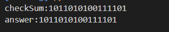
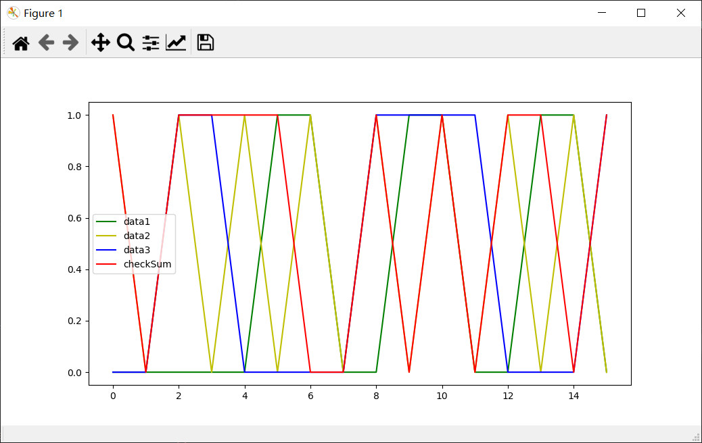

# 第五次作业

**2017302580214 曾志昊**

----

## UDP   校验和

* 代码展示了校验和的最主要计算步骤，其余部分代码在  “CheckSum.py”  文件中可见

```python
def checkSum(datas):
    # 逐个计算
    result = 0x0000
    for data in datas:
        result = result + data
        result = (result & 0xFFFF) + (result >> 16)
    #取反 
    result = 0xFFFF - result
    return result
```

* 程序运行结果如下，与答案相同



* 此外，在程序中将所有数据的对应位以及最后的结果都通过matplotlib绘制出来



-----


**p3**

  01010011  +  01100110  +  01110100  =  00101110  反码为 11010001

​	使用反码好处是：不受系统大小端的影响

​	只要把三个字节与检验和相加，各位不全为1则表示出错

​    1比特的差错一定会使得相加的结果不同，而2比特的差错刚好在同一个位置上则相加结果相同，检测不出

**p4**

* a	01011100 + 01100101 = 11000001

  ​		反码为 00111110

* b    11011010 + 01100101 =  00111111

  ​		反码为 11000001

* c     01011100 -> 01011101

  ​	   01100101 -> 01100100

  ​	   01011101 + 01100100 = 11000001

