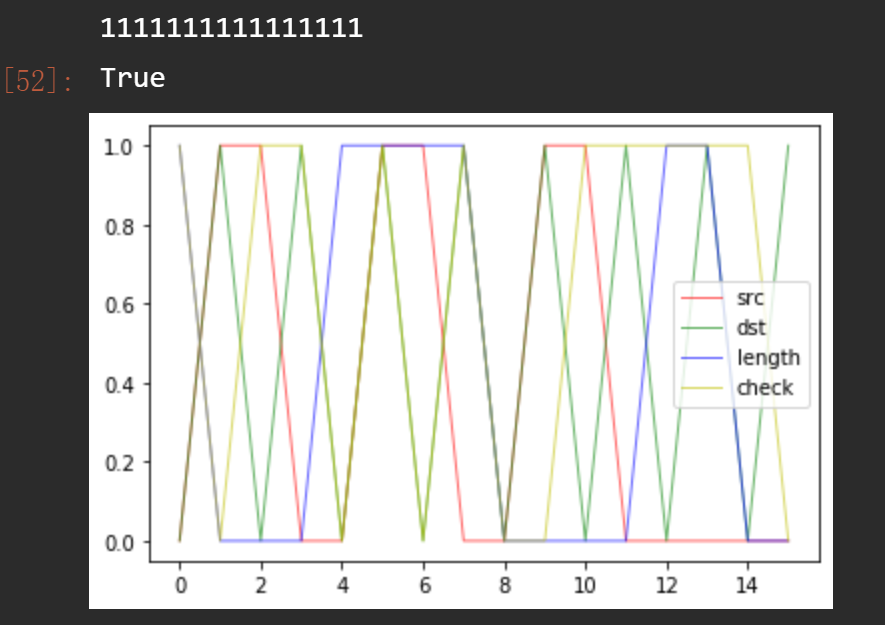

### 一. UDP 检验和

UDP的首部包括四个字段，每个字段包含两个字节（16 bits），发送端通过前三个字段（源端口、目的端口以及长度）的二进制和的反码（此处出现加法溢出则回卷）来计算出最后一个检验和字段；接收端利用接收到的UDP报文首部的四个字段求和，若和的每个比特位均为1，则能通过检验，否则说明报文信息有差错。

下面是在 Jupyter上用python编写的主要程序，将每个字段都定义为 Field 类，重载 + 操作符方便处理。[这里是 ipynb文件全部源代码](assets/UDPcheck.ipynb)

```python
len_bit = 16
class Field:
    def __init__(self, digit):
        # 16 bits
        assert len(digit) == len_bit
        self.digit = digit 
    def __add__(self, o):
        re = []
        carry = 0
        for i in reversed(range(len_bit)):
            t = int(self.digit[i]) + int(o.digit[i]) + carry
            carry = int(t / 2)
            re.append(int(t % 2))
        re.reverse()
        rStr = ''
        for r in re: rStr += str(r)
        return Field(rStr)
    def inverse(self):
        rStr = ''
        for r in self.digit:
            rStr += '1' if r == '0' else '0'
        return Field(rStr)
    def get_int_list(self):
        return [int(e) for e in self.digit]
    
def getCheck(src, dst, length):
    return (src + dst + length).inverse()
def checkNum(src, dst, length, check):
    x_list = range(16)
    # plot four field values
    plt.plot(x_list, src.get_int_list(), color='r', linewidth=1, alpha=0.6)
    plt.plot(x_list, dst.get_int_list(), color='g', linewidth=1, alpha=0.6)
    plt.plot(x_list, length.get_int_list(), color='b', linewidth=1, alpha=0.6)
    plt.plot(x_list, check.get_int_list(), color='y', linewidth=1, alpha=0.6)
    plt.legend(['src','dst','length','check']) 
    # check whether the information loss
    re = (src + dst + length + check).digit
    print(re)
    if re == '1' * 16: return True
    else:return False
```


下面是在 Jupyter 里使用 matplotlib打印出的接收端收到的每个字段的值以及检验和的结果。




### 二. 课后习题

#### P4

答：

- a)$inverse(01011100 + 01100101) = inverse(11000001) = 00111110$
- b)$inverse(11011010 + 01100101) = inverse(00111111) = 11000000$
- c) 第一个字节变成 01111100, 第二个字节变成 01000101


#### P6

答：用一个例子来说明，假设接收方当前处于 等待接收0包的状态，发送方处于等待接收方发来0包的响应的状态。这时接收方收到 无损坏的0包，将ACK回传并使自身状态切换至等待接收 1包的状态；但回传的ACK包发生了损坏，导致发送方接收到不正常的响应，认为接收端没有收到0包，于是继续发送0包给接收方，其自身状态保持不变。而0包不是接收方需要的包，无法引起接收方的状态转换，会一直回传 NAK给发送方，而NAK也无法引起发送方的状态转换，于是死锁就产生了。