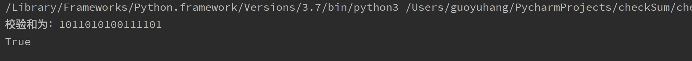
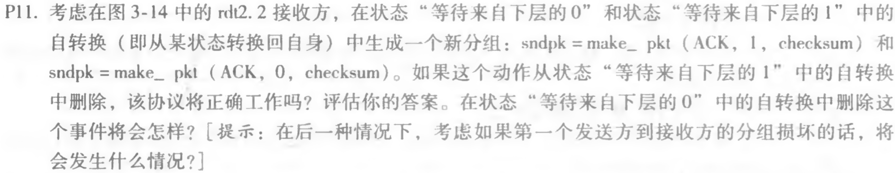
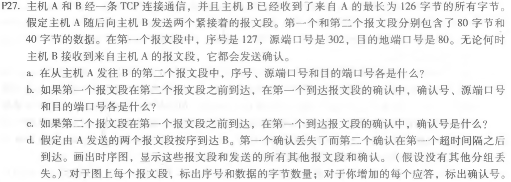
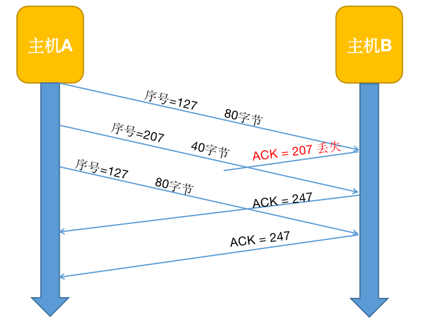

##### Python 校验和：

```python
import numpy as np`

`def checkSum(bits: list)-> int:`
    `result = 0`
    `for bitWord in bits:`
        `result += bitWord`
        `if result > 0xffff:`
            `result = (result % (1 << 16))+(result >> 16)`
    `result = np.invert(result)`
    `return result`

`if __name__ == '__main__':`
    `data = [int("0110011001100000", 2), int("0101010101010101", 2), int("1000111100001100", 2)]`
    `checksum = checkSum(data)`
    `print("校验和为：" + np.binary_repr(checksum, width = 16))`
    `print("1011010100111101" == np.binary_repr(checksum, width = 16))
```




#### P11.



答：

> rdt2.2保留与rdt2.1相同的功能，仅使用ACK，代替NAK，接收端发送ACK以确认最后接收到的分组是否正常。
>
> 接收端必须明确包含被确认的分组的序号。
>
> 发送端收到的ACK复本导致与NAK相同的操作：重传当前分组


- 可以正常工作，因为sndpkt在之前状态转移的过程中已经被存储
- 若考虑第一个发送方到接收方的分组损坏，则发送端会收到重复的ACK，会重传当前分组，进入死锁。

#### P27.



答：

> a. 序号是：207 (127+80)，源端口号：302，目的端口号：80。
>
> b. 如果第一个报文段在第二个报文段之前到达，在第一个到达报文段的确认中，确认号：207，源端口：80，目的端口号：302。
>
> c. 如果第二个报文段在第一个报文段之前到达，在第一个到达报文段的确认中确认号：127。
>
> d.如下图




