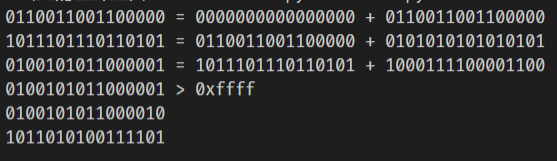

## 代码

代码见`test.py`

## 作业题

- P3

~~~
01010011 +
01100110 =
10111001
--------
10111001 +
01110100 =
100101101 > 11111111
--------
00101101 + 1 =
00101110
--------
11010001
// 为什么用和的反码，如何检错
三个字节和校验和相加 每一位都为1
// 检测出错
1bit一定可以检出，结果中会有0
2bit不一定会检出，比如有2字节在同一位出错
~~~

- P14

~~~
第一个情况不会比使用ACK更好。因为只是偶尔发送消息不是一直持续发送。如果第一个消息没有接收到，且因为偶尔发送是不会很快得重新发送。会导致接收方不能及时接收到消息。 第二个情况只使用NAK会更好，因为端到端很少丢包，且发送大量数据。这时不采用ACK可以加大效率。
~~~

