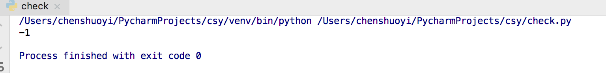
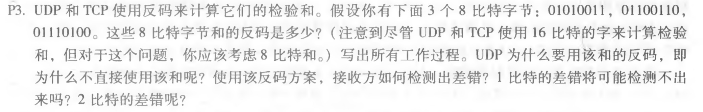

## 使用python实现UDP的16位校验和

```python
def checksum(data):
    sum = 0
    for i in data:
        sum = sum + (i&0xffff)
        if sum < 0xffff :
            sum = (sum>>16) + (sum&0xffff)
    return ~(sum&0xffff)

def sum(data):
    sum = 0
    for i in data:
        sum = sum + (i&0xffff)
    return (sum&0xffff)

data = [0b0110011001100000,0b0101010101010101,0b1000111100001100]
print(checksum(data) + sum(data))
```

验证结果：




## 第三章习题



求和：

01010011 + 01100110 =  10111001

10111001 + 01110100 =  100101101

回卷：

00101101 + 1 = 00101110

求反码：11010001

使用该和的反码是为了方便检测出差错，接收方计算三个字节的和与校验和相加，得到的结果每一位都为1。

1比特的差错一定会导致求和的结果不一样，可以检测出。

2比特的差错有可能不会影响求和结果，可能检测不出。


只使用ACK的协议的情况下，如果发送方接收到的ACK损坏就会马上重传，相比之下使用NAK的协议分组丢失在隔较长时间后才会得到重传，如果发送大量数据并且端到端连接很少丢包，只用NAK的协议会更好，发送的数据量更少。


