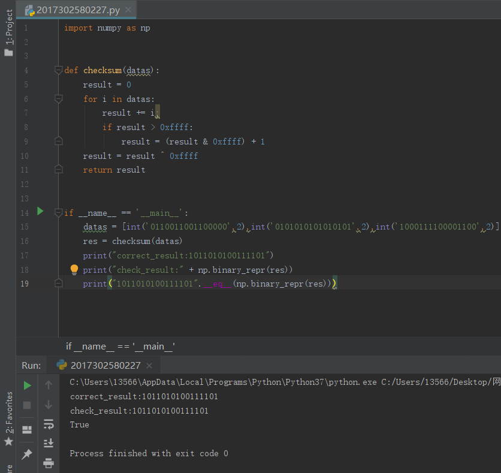

# 网络及分布式计算第五次作业

###  python实现16位UDP校验和

将十六进制换算为十进制依次相加，若出现溢出就进行回卷操作，最后对结果取反，就可以获得校验值。

## 课后习题

### P2

假设主机A、B和C的IP地址分别为a、b、c。

主机A：源端口=80，源IP地址=b，DEST端口=26145，DESTIP地址=a

到主机C，左进程：源端口=80，源IP地址=b，DEST端口=7532，DESTIP 地址=c

到主机C，右进程：源端口=80，源IP地址=b，DEST端口=26145，DEST IP地址=c。

B)是的，Bob仍然需要执行并行下载；否则，他将获得比其他四个用户更少的带宽。

### P4

a)将这两个字节相加得到11000001。取一个人的补给量就等于00111110。

b)把这两个字节相加，等于01000000；补码等于10111111。

c)第一个字节=01010100；第二个字节=01101101。