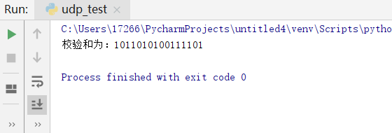

#####  UDP测试

用 python 实现 UDP 的16位校验和，并用该程序验证课本3.3.2节的计算

三个16比特的字：

0110011001100000

0101010101010101

1000111100001100

程序结果：

##### 第三章习题

##### p3

01010011+01100110+01110100=00101110

其反码是11010001

使用反码的好处：

1.不依赖系统是大端还是小端

2.计算检验和比较简单快速

接收方检验差错的方法是将三个字节与检验和相加，如果任何一个位为 0，说明出错。1比特的差错肯定会导致结果不同，2比特的差错可能会检测不出。

##### p11

如果从“等待来自下层的1”中删除，不会影响正常工作，因为 sndpkt 已经被生成了。
但是如果从“等待来自下层的0”中删除，而且接收方刚刚启动（处于初始状态），sndpkt 是一个错误的值（很可能是一个随机值），那么发送方会认为 ACK 损坏并重发分组，接收方会继续发送错误值，这将导致一个死锁。
