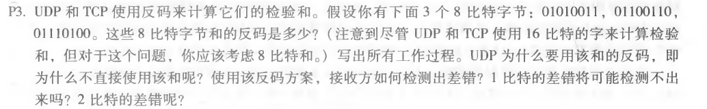
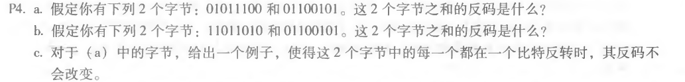

## 一：python实现16位的UDP校验和

原代码如下：

```python
def check(datas):
    _sum=0
    for _data in datas:
        _sum=_data+_sum
    _sum=displacement(_sum)
    _sum ^= 0xffff
    return _sum
def displacement(data):
    while True:
        _low = data & 0xffff
        _high = data >> 16
        if _high>0:
            data=_low+_high
        else:
            return data


datas = [0b0110011001100000, 0b0101010101010101, 0b1000111100001100]
if __name__ == '__main__':
    sum=check(datas) + datas[0] + datas[1] + datas[2]
    sum=displacement(sum)
    if  sum== 0xffff:
        print('校验结果正确')
    else:
        print('校验结果失败')


```

输出如下

```python
校验结果正确

Process finished with exit code 0
```


## 二：课后作业

#### 第三题：



A:三者相加为：01010011+01100110+01110100=10111001+01110100=100101101，

​	产生溢出，所以实际的结果是00101110

​	所以反码是**11010001**

	使用反码有以下好处：
		不依赖系统是大端还是小端
		计算检验和比较简单快速

```
接收方检验差错的方法是将三个字节与检验和相加，如果任何一个位为 0，说明出错
	1比特的差错肯定会导致结果不同
	2比特的差错可能会检测不出，比如题中第一、二字节变为 01010010，01100111，即最后一个比特反转
```

#### 第四题：



A：

​	**a**:01011100+ 01100101 = 11000001,所以反码是**00111110**

​	**b**:11011010+ 01100101 =100111111,所以反码是**011000000**

​	**c**:a 中的第一、二字节变为 01011101、01100100

