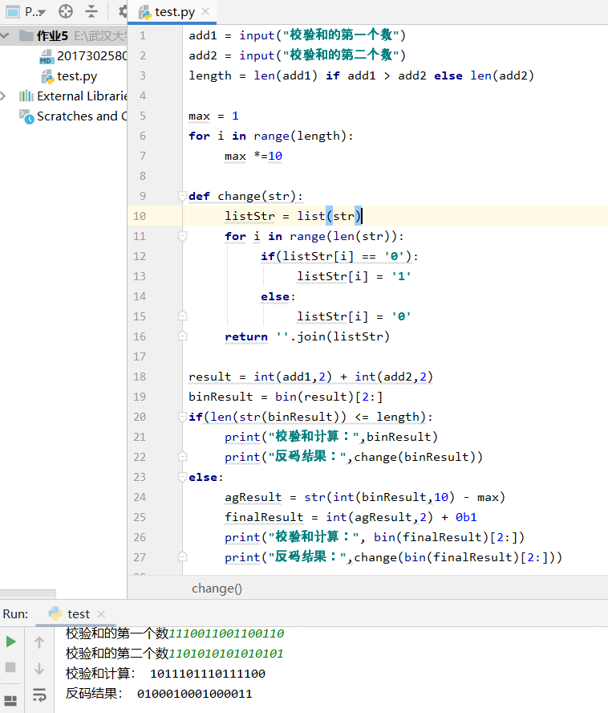

验证校验和，如下图所示

习题

P2 

从 B 到 C：
   左边的连接：源端口号 80，源 IP 为 B 的 IP；目的端口 26145，目的 IP 为 C 的 IP；
   右边的连接：源端口号 80，源 IP 为 B 的 IP；目的端口 7532，目的 IP 为 C 的 IP；

从 B 到 A：
   源端口号 80，源 IP 为 B 的 IP；目的端口 26145，目的 IP 为 C 的 IP；

P4

a.  01011100 + 01100101 = 11000001 反码为00111110

b.  11011010 + 01100101 = 01000000（溢出回卷） 反码为10111111

c.  第一个字节= 01010100; 第二个字节= 01101101

