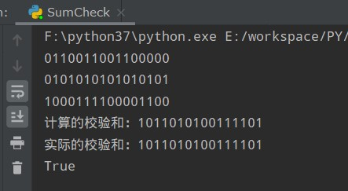
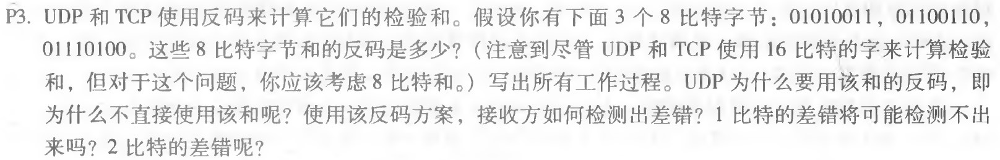
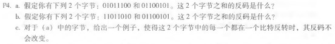

# 网络及分布式计算作业（五）

[toc]

## UDP校验和

```python
def get_sum(bit_list: list) -> int:
    """
    计算校验和
    @param bit_list:待计算校验和
    @return:校验和结果（整数形式）
    """
    sum_res = 0
    maximum = pow(2, 16) - 1
    for i in bit_list:
        if not 0 <= i <= maximum:
            return -1
        sum_res += i
        sum_res = sum_res % (maximum + 1) + sum_res // (maximum + 1)
        sum_res = sum_res % (maximum + 1) + sum_res // (maximum + 1)
        print(np.binary_repr(i, 16))
    print"计算的校验和："+np.binary_repr(sum, 16))
    sum_res = np.invert(sum_res)
    return sum_res


def check(bit_list: list, sum_value):
    """
    UDP校验和校验
    @param bit_list:待计算校验和的
    @param sum_value:
    @return:是否通过校验
    """
    return np.binary_repr(get_sum(bit_list), 16) == np.binary_repr(sum_value, 16)
```

运行校验测试：

```python
res = check(
        [
            int("0110011001100000", 2),
            int("0101010101010101", 2),
            int("1000111100001100", 2)
        ],
        int("1011010100111101", 2))
    print("实际的校验和：" + "1011010100111101")
    print(res)
```




## 课后习题

### P3



  01010011
+01100110 = 10111001

  10111001
+01110100 =  1 0010 1101

回卷：0010 1110

反码：1101 0001

使用反码有以下好处：

1. 不依赖系统是大端还是小端
2. 计算检验和比较简单快速

接收方检验差错的方法是将三个字节与检验和相加，如果任何一个位为 0，说明出错；

1比特的差错一定可以检测出来；

2比特的差错可能检测不出来，比如01010011变为01010010, 同时01100110变为01100111, 

### P4

### 

a. 16位反码为: 1111 1111 0011 1110；

​	8位反码为：0011 1110；

b. 16位反码为: 1111 1110 1100 0000；

​	8位反码为：10111111；

c. 两个字节变为：01011101，01100100


