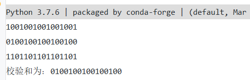
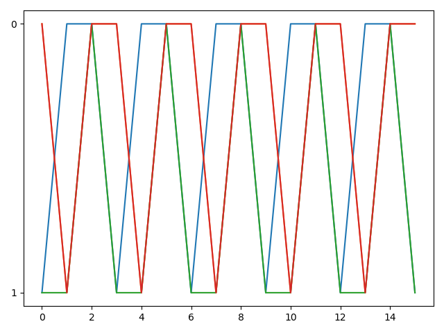

# 网络及分布式 第五次作业

[TOC]

## UDP校验和

```python
def checksum(data_list):
    """Compute the Checksum"""
    result = 0
    # Compute the sum
    for t in data_list:
        result += t
        t = bin(t)[2:]
        t = str.zfill(t, DIGIT_LENGTH)
        print(t)
        t = np.asarray(list(t))
        plt.plot(t)
    # if the length of the result is more than 16, then rollback
    if result >= pow(2, DIGIT_LENGTH):
        result = result - pow(2, DIGIT_LENGTH) + 1
    # abs is to remove the symbol, [2:] is to remove 0b which is binary format in python
    result = bin(result ^ 0xFFFF)[2:]
    result = str.zfill(result, DIGIT_LENGTH)
    print('校验和为：' + result)
    result = np.asarray(list(result))
    plt.plot(result)
    plt.show()
    return result
```

输入结果：





## 课后习题

### P2

对于A而言，源IP为B，源端口号为80；目的IP为A，目的端口为26145。

对于C而言，源IP都为B，源端口号都为80；

左边的目的IP为C，目的端口号为7532。

右边的目的IP为C，目的端口号为26145。

### P3

```
   0 1 0 1 0 0 1 1
 + 0 1 1 0 0 1 1 0
------------------
   1 0 1 1 1 0 0 1
 + 0 1 1 1 0 1 0 0
------------------
 1 0 0 1 0 1 1 0 1
```

要回卷，得到0 0 1 0 1 1 1 0

反码为：1 1 0 1 0 0 0 1

使用反码的优点：不依赖系统是大端小端，直接通过上面的算法就可以得到正确的结果。

接收方需将全部4个字节相加，如果得到1 1 1 1 1 1 1 1 1 1 1 1 1 1 1 1，即全部位上均为1，即为正确，反之不正确。

1比特的错误一定可以检测出来，2比特的错误不一定能检测出来。