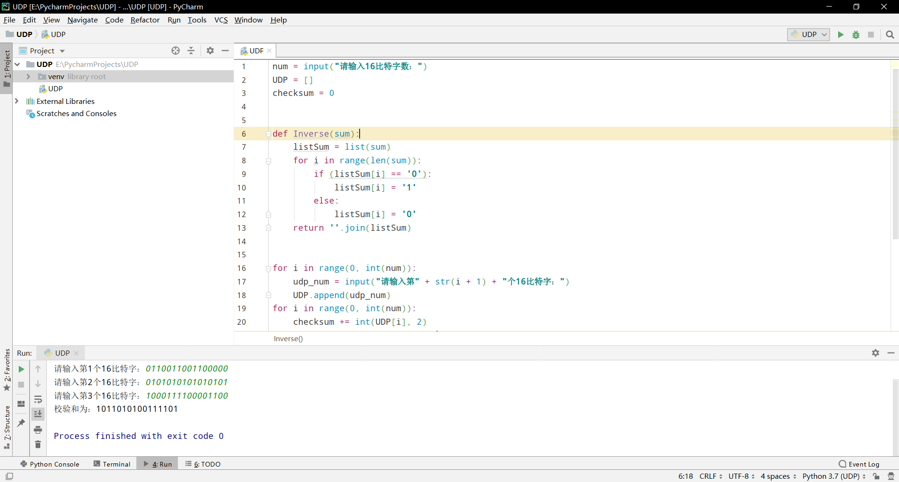

## 验证3.3.2的计算

与课本给出的校验和一致

## P3

将所给三个字节相加：

01010011 + 01100110 = 10111001

10111001 + 01110100 = 100101101

反卷得：00101110

故校验和即反码为：11010001

## P4

#### a. 

01011100 + 01100101 = 11000001

反码为：00111110

#### b.

11011010 + 01100101 = 100111111

反码为：011000000

#### c.

01011101、01100100

