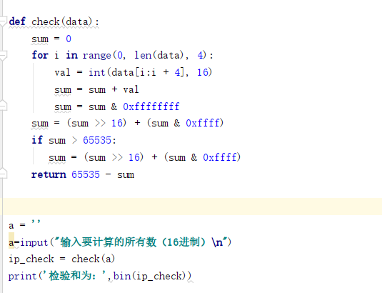
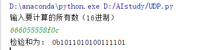

## UDP的16位验证和
程序为： 
 
首先输入要计算的所有数，按照16进制输入，将输入的字符串每四个分开转换为整数型，然后分别相加，先不处理溢出后代，将所有数相加结束后得到结果的前16位上就是溢出的结果，将其与后16位相加得到最后的和，最后利用655535-sum得到反码和。  
验证课本上的过程为（结果与课本相同）：

## 课后习题 
### P3
前两字节的和为10111001，该和加上第三个字节发生了溢出进行回卷后的结果为：00101110，故其反码和为11010001。使用该和的反码是为了脱离对系统大端与小端的依赖。通过将得到的字节的和与计算出来的反码和进行相加看是否所有位上都为1，所得的结果任何一位上出现了0即为出错。1比特的差错都能检验出来，2比特的差错可能检测不出来。
### P6 
假如发送端重发了依次0或1，则陷入死锁：接收端一直在等待正确的包，但发送端一直在重复发送错误的包。
