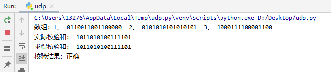

## python实现udp16位校验和

实验步骤：

​	1、求校验和：传入数组，并将每个数相加，当和溢出时，回卷；

​	2、验证校验和：将求出的校验和与已知的校验和对比。

​	2、将每个数相加，当和溢出时回卷

​	3、将和求反，结果为校验和

​	4、验证所求校验和正确性：将求出的校验和与

详情见UDP.py

以下为结果：

# 作业

### 1、p3

#### UDP和TCP使用反码来计算它们的检验和。假设你有下面3个8比特字节：01010011, 01100110,01110100.这些8比特字节和的反码是多少？（注意到尽管UDP和TCP使用16比特的字来计算检验 和，但对于这个问题，你应该考虑8比特和。）写岀所有工作过程。UDP为什么要用该和的反码，即为什么不直接使用该和呢？使用该反码方案，接收方如何检测出差错？ 1比特的差错将可能检测不出来吗？ 2比特的差错呢？	

​	01010011

  +01100110

——————

  =10111001

  +01110100

——————

=1 00101101

回卷：00101110

反码：11010001

校验时直接将数据相加，如果其中包含0则说明出现差错，检验简单方便。

1比特差错可以检测出

2比特差错不能检测

### 2、p4

#### a.假定你有下列2个字节：01011100和01100101.这2个字节之和的反码是什么？

#### b. 假定你有下列2个字节：11011010和01100101.这2个字节之和的反码是什么？

#### c. 对于（a）中的字节，给出一个例子，使得这2个字节中的每一个都在一个比特反转时，其反码不会改变

a）、

​	01011100

  +01100101

——————

  =11000001

反码：00111110

b）、

​	11011010

  +01100101

——————

  =100111111

回卷：01000000

反码：10111111

c）、01011101、01100100