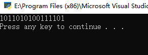

# UDP检验合

```
num1 = '0110011001100000'
num2 = '0101010101010101'
num3 = '1000111100001100'
num1 = int(num1,2)
num2 = int(num2,2)
num3 = int(num3,2)
add1 = 0
add2 = 0 
result = ""
if len(bin(num1+num2)) > 18:
    add1 = int(str(bin(num1+num2))[3:],2 )+1
else:
    add1 = int(str(bin(num1 + num2))[2:], 2)
if len(bin(num3+add1)) > 18:
    add2 = int(str(bin(num3 + add1))[3:], 2) + 1
else:
    add2 = int(str(bin(num1 + add1))[2:], 2)
add2 = str(bin(add2)[2:])
while len(add2)!=16:
    add2 = "0"+add2
for i in add2:
    if i == "0":
        result += "1"
    else:
        result += "0"
print(result)
```

结果



# 作业题

P3

1 0 1 1 1 0 0 1

0 1 1 0 0 1 1 0

=

0 1 0 1 0 0 1 1

------

0 1 1 1 0 1 0 0

1 0 1 1 1 0 0 1

=

0 0 1 0 1 1 1 0

补码为： 1 1 0 1 0 0 0 1

方便检测错误，接收方计算四个16位比特和。如果结果包含零，则有错误。

一位错误都能检验 两位错误不一定

P6、发送方发送1转为等待ack或NAK0状态，接收方收到并发送ACK并转为等待来自下层的1状态，ACK损坏，发送方继续发0，但接收方想要1，形成死锁。