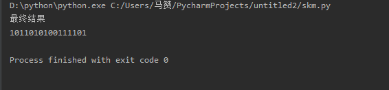

# 实验
详情见skm.py 文件
##
运行结果如下

# 第三章习题
## p2
```
从B到C：
   左边的连接：源端口号80，源IP为B的IP；目的端口26145，目的IP为C的IP；
   右边的连接：源端口号80，源IP为B的IP；目的端口7532，目的IP为C的IP；

从B到A：
   源端口号80，源IP为B的IP；目的端口26145，目的IP为C的IP；
```
## p3
```
  01010011
+ 01100110
= 10111001
+ 01110100  （相加后出现进位 于是只取后八位同时最后一位加1）
= 00101110

取反后 反码为 11010001

使用反码好处是
  1.不依赖系统是大端还是小端
  2.计算检验既快速又简单
 
检验方只要把三个字节与检验和相加，如果任何一位为0，则出错

  1.比特的差错肯定会导致结果不同
  2.比特的差错可能会检测不出，比如题中第一、二字节变为 01010010，01100111，即最后一个比特反转


```
