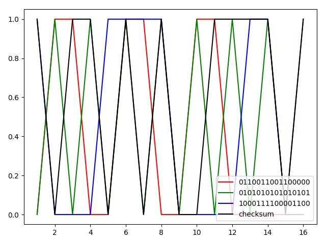

## 作业5
**1、UDP checksum**
```python
import numpy as np
from matplotlib import pyplot as plt

data = ["0110011001100000","0101010101010101","1000111100001100"]
sum = 0
max_num = pow(2, 16)
for i in data:
    sum += int(i, 2)
    sum = (sum % max_num) + (sum // max_num)
print("和：{}".format(sum))
checksum = np.binary_repr(~sum, width=16)
print("校验和：{}".format(checksum))

x, y = range(1,17),list(map(int,list(data[0])))
plt.plot(x, y, "r",label='0110011001100000')
x, y = range(1,17),list(map(int,list(data[1])))
plt.plot(x, y, "g",label='0101010101010101')
x, y = range(1,17),list(map(int,list(data[2])))
plt.plot(x, y, "b",label='1000111100001100')
x, y = range(1,17),list(map(int,list(str(checksum))))
plt.plot(x, y, "black",label='checksum')
plt.legend(loc="lower right")
plt.show()

```

### 课后题
**P4**
```
a)这两个字节相加等于11000001。补码等于00111110。
b)这两个字节相加等于01000000；补码等于10111111。
c)第一个字节01010100；第二个字节01101101。
```
**P5**
```
不能完全确定没有发生任何位错误。
如果包中两个16位字的对应位是0和1发生翻转到1和0，如字A: 101->010，字B: 010->101，校验和仍然保持不变。
```
