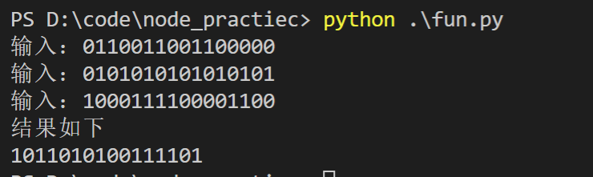
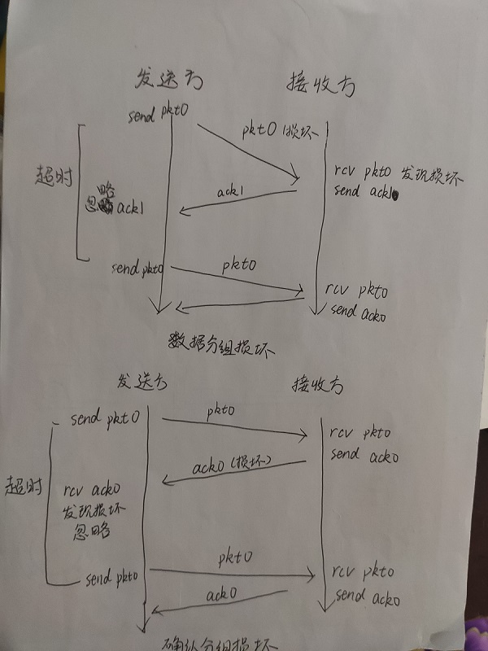

# 网络分布式作业-5

## 代码运行结果

## 习题

* p3

      01010011

    +<u>01100110</u>

      10111001
  
    +<u>01110100</u>
  
      00101110
  
    反码为11010001；
  
    使用反码便于确认检验和无误（全为1）， 不依赖系统是大端小端 ，检验流程相同；
  
    当计算检验和所有位都为1时，无差错；
  
    1bit的差错必然导致检验和变化；2bit差错不一定能检测，如两个比特字节某位值互换时。
  
* p9

    
    
    
