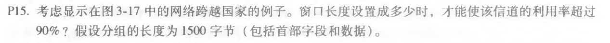

## Homework_5

**Author：**

姓名： 王泽生

学号：2017302580268

第三章习题：**P4、P15**

**注**：**公式查看**请安装 Chrome浏览器插件：**MathJax Plugin for Github** 

### 1 用 python 实现 UDP 的16位校验和，并验证教材计算

python 文件见文件夹 `UDPCheckSum.py` ,验证教材计算结果为正确，截图如下：

### 2 课本第三章习题

#### P4

**a.**

字节之和为：11000001

字节值和的反码为：001111110

**b.**

字节之和为：01000000

字节值和的反码为：10111111

**c.**

第一个字节为：01010100

第二个字节为：01101101

#### P15

**解答：**

传输时间 $t_{trans} = \frac{L}{R}=\frac{1500*8 bit/pkt}{10^9 bit/s}=12\mu{s}/pkt$

信道利用率：$U_{sender}=\frac{NL/R}{RTT+L/R}>0.9$

光速往返传播时延：$RTT=30ms$

有$N>\frac{0.9*(30+0.012)}{0.012}\approx2251$

故窗口长度设置成 2251 以上才能满足题意。

