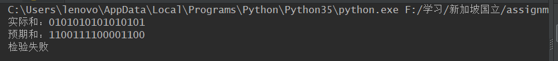
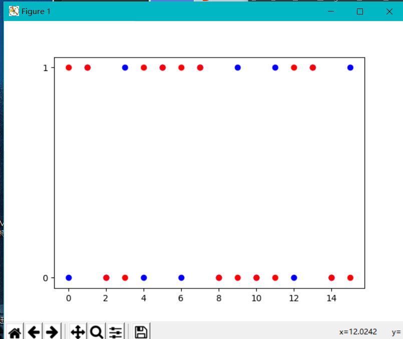

## 分布式计算与网络第五次作业

### 1. 16位UDP校验
思路：首先对输入的UDP数据按照16位进行切片，再将这些16位的序列求和，求和时注意回卷，求和完毕后对结果取反。  
使用matplotlib对预期和和实际和进行对比，横坐标为位数，纵坐标为数值（0/1）。


蓝色为实际和，红色为预期和




### 2. 习题


#### p4
```
a. 00111110
b. 01000000
c. 只需要保持两者和相等，一个加一，一个减一，变为01011101、01100100

```

#### p7
```
ACK不需要序号是因为，ACK只负责通知的作用，其数据本身没有其他的作用，不需要记录其序号。

```
