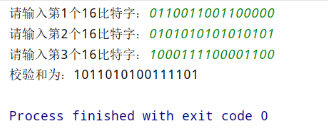

# 网络与分布式计算作业5

## 验证

结果相同

## 课后题

### P3

字节和：100101101

回卷：00101110

反码：11010001

使用和的反码检测更加方便。

1比特的差错一定能检测出来，2比特的差错可能检测不出来.

### P4

a. 01011100+01100101=11000001
反码为：00111110

b. 11011010+01100101=100111111
反码为：011000000

c. 两个字节：01010100、01101101
和为：11000001
