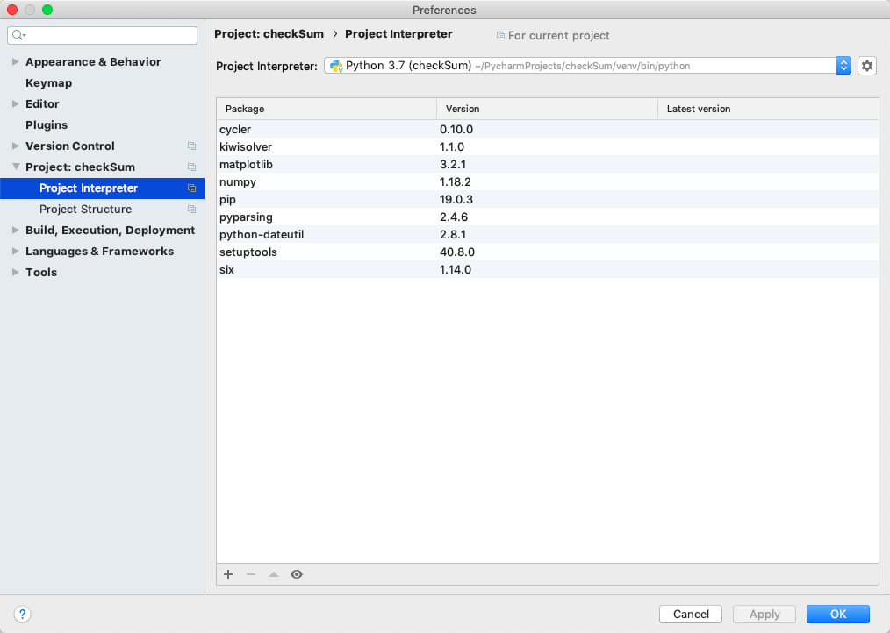
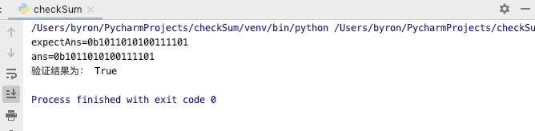
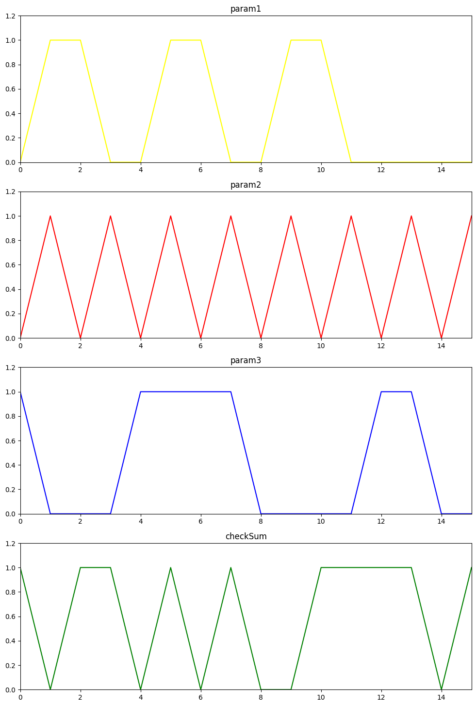
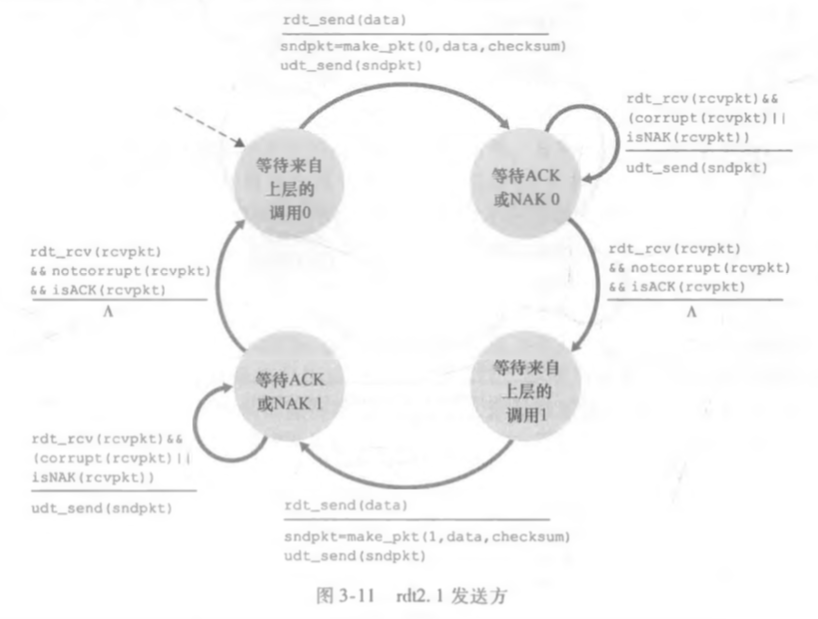
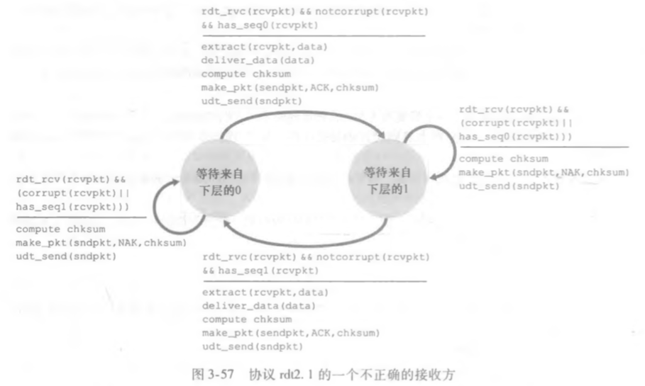

## python实现udp16位校验和

* 开发工具：PyCharm

* 导入matplotlib包：在Preference中的Project Interpreter中点击+号选择需要的包导入，结果如下



* 核心代码

  ```python
  def check_sum(i_list):
      ans = 0
      for d in i_list:
          ans += d
      ans = (ans & 0xffff) + (ans >> 16)
      return 0xffff - ans
  ```

* 验证的输出

  

* 使用matplotlib画图

  

* 其它见checkSum.py


## 课后题

**P3. UDP和TCP使用反码来计算它们的检验和。假设你有下面3个8比特字节:01010011, 01100110, 01110100.这些8比特字节和的反码是多少?(注意到尽管UDP和TCP使用16比特的字来计算检验和，但对于这个问题，你应该考虑8比特和)写岀所有工作过程。UDP为什么要用该和的反码，即为什么不直接使用该和呢?使用该反码方案，接收方如何检测出差错? 1 比特的差错将可能检测不出来吗? 2比特的差错呢?**  

字节和为 1 0010 1101 ，回卷相加得0010 1110，反码为1101 0001

使用反码好处：（1）不依赖系统是大端还是小端（2）便于计算检验

接收端检验方法：将3个字节与检验和相加，结果不为1111 1111则出错

1bit的差错不可能检验不出来，2bit的差错如果错在同一位上检测不出来


**P6.考虑我们改正协议rdt2. 1的动机。试说明如图3-57所示的接收方与如图3-11所示的发送方运行时,接收方可能会引起发送方和接收方进人死锁状态，即双方都在等待不可能发生的事件。**





若发送方在状态”等待来自上层的0“，接受方状态在”等待来自下层的0“，发送端发送0号分组进入状态”等待ACK或NCK 0“，接收端接收分组并发送ACK进入状态”等待来自下层的1“，若此ACK丢失，发送端会重新发送0号分组，接收端has_seq0(sndpkt)为真一直处于状态”等待来自下层的1“，且返回发送端NAK，发送端因此一直处于状态”等待ACK或NCK 0“，形成死锁