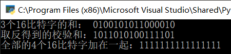
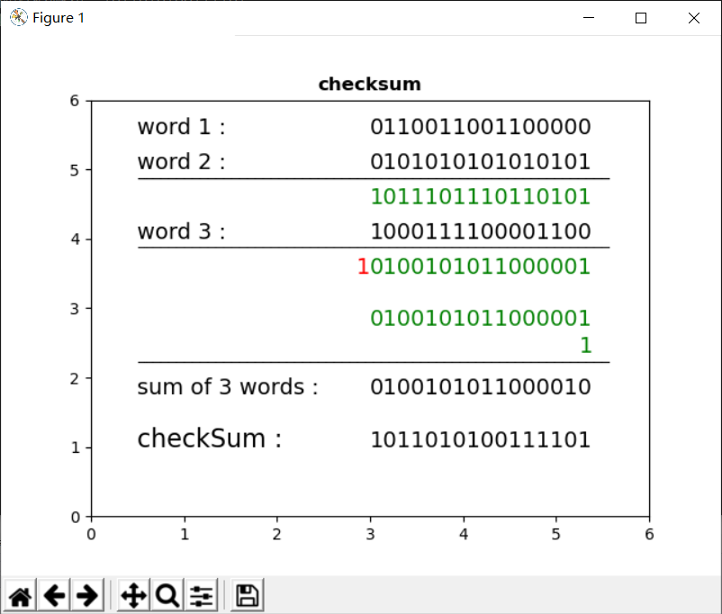
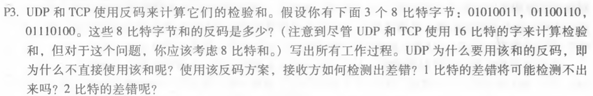
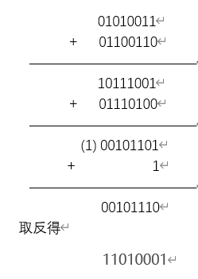
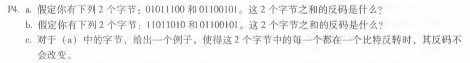

# 网络及分布式计算


## *第五次作业*

---------------------------------------------  
### 一.  用python实现UDP16位校验和，并验证3.3.2的计算  
``` python
import matplotlib
from matplotlib import pyplot as plt

def _sum(data_1,data_2,data_3):
    temp = data_1+ data_2
    temp = (temp&0xFFFF) + (temp>>16)
    temp = temp + data_3
    temp = (temp & 0xFFFF) + (temp >> 16)
    return temp

if __name__ == '__main__':

    #  0b 表示是 二进制表示
    data_1 = 0b0110011001100000
    data_2 = 0b0101010101010101
    data_3 = 0b1000111100001100
    # 三个字的“和”
    temp = _sum(data_1,data_2,data_3) 
    # 检验和，与按位取反等效
    checkSum = temp^0xFFFF
    #  zfill(length) 在length的长度里从左往右自动补零（0b不再出现）
    print("3个16比特字的和： "+ bin(temp)[2:].zfill(16))
    print("取反得到的校验和：" + bin(checkSum)[2:].zfill(16))
    print("全部的4个16比特字加在一起：" + bin(temp+checkSum)[2:].zfill(16))

```
  
  注：matplotlib画图部分详见.py文件。  
    
  验证3.3.2 ：  
    
  
过程：

  


### 二.  第三章课后题任选两题  

####  P3  



##### 答：  

  
  使用反码的好处：计算检验和比较简单快速。  
  检验差错的方法：将三个字节与检验和相加，如果任何一个位为 0，说明出错。  
  1比特的差错一定会检测出来，2比特的差错可能检验不出来。

####  P4  



##### 答：  
a. 00111110  
b. 01000000  
c. a 中的第一、二字节变为 01011101、01100100


