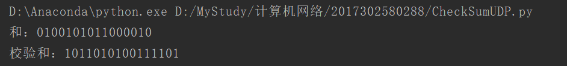
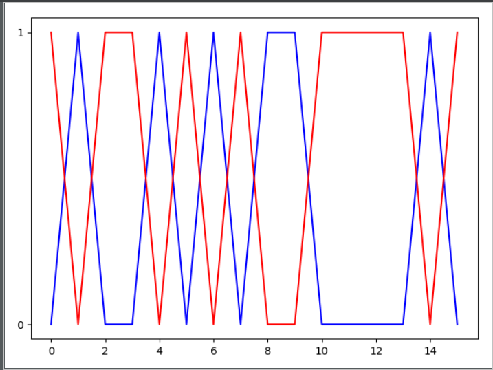

# HOMEWORK5

2017302580288 李沛昊

## 验证UDP校验和

利用python编写验证UDP校验和的程序，并且使用matplotlib包进行可视化，详细实现过程可看CheckSumUDP.py文件：

## P12

**问题：**

rdt3.0协议的发送方直接忽略（即不采取任何动作）接收到的所有出现差错和确认分组的确认号 （acknum）字段中的值有差错的分组。假设在这种情况下，rdt3. 0只是重传当前的数据分组，该协 议是否还能正常运行？（提示：考虑在下列情况下会发生什么情况：仅有一个比特差错时；报文没 有丢失但能出现定时器过早超时。考虑到当几趋于无穷时，第"个分组将被发送多少次。）  

**解答：**

1、当考虑发生一个比特位的错误时，协议仍能正常工作，因为在原本的协议中，碰到这种情况也会再超时后重传分组。这个改变只是提前了重传的行为。

2、当考虑到过早超时的情况。每一个超时的ACK都会导致当前分组被重发，因此累计到第n个分组，第n个分组会被重传n次，也就是第n个分组会被重传接近无限次。

## P14

**问题：**

考虑一种仅使用否定确认的可靠数据传输协议。假定发送方只是偶尔发送数据。只用NAK的协议 是否会比使用ACK的协议更好？为什么？现在我们假设发送方要发送大量的数据，并且该端到端 连接很少丢包。在第二种情况下，只用NAK的协议是否会比使用ACK的协议更好？为什么？

**解答：**

1、偶尔发送数据的情况下，考虑分组丢失的情况，接收方只有在接收到n-1和n+1分组时才会发现n分组的丢失并发送NAK。若发送方在发送n分组后很久都不发送n+1分组，则n分组在丢失后要过很久才会被重发。因此不比ACK协议更好。

2、当发送数据很多且丢包较少的情况下，很显然接收方NAK会比ACK少发送很多分组。

## P15

**问题：**

考虑显示在图3・17中的网络跨越国家的例子。窗口长度设置成多少时，才能使该信道的利用率超过 90%?假设分组的长度为1500字节（包括首部字段和数据）。 

**解答：**

$U_{sender}=0.9 = \frac{n\frac{L}{R}}{RTT+\frac{L}{R}}$

$\frac{L}{R}=0.012ms$

$RTT=30ms$ 

因此，窗口长度$n=2251$

