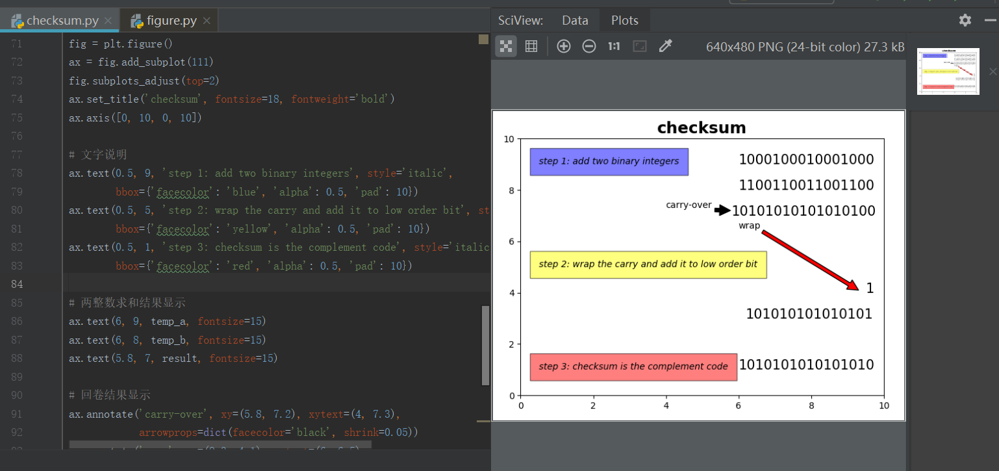

# 第五次作业
2017302580289/卢羽帆

------

## 第3章习题P4
a.字节之和的反码是00111110
b.字节之和的反码是10111111
c.两个字节的最低位都改变时，字节之和的反码不变

## 第3章习题P6
这个接收方在等待1的状态下接收到序号0的分组就会发送nak，如果发送方发送了序号0的分组，接收方成功接收后，发送的ack损坏了，那么发送方就会重新发送0，可是接收端这时候等待的是1，就会发送nak，然后接收方和发送方进入死锁，因为发送方在不停发送重复的0，接收方希望收到的分组序号是1就一直等待1

## 第3章习题P12
第一种情况下，只用nak不会更好，因为发送方只偶尔发送数据，但是接收方是根据丢失的包的下一个包才能发现丢包，所以可能一直不能发现丢包。
第二种情况下，使用nak可能更好，因为发送大量数据而且不丢包时只用nak可以减少要发送的数据

------
## 效验码
1.将二进制整数求和
2.若求和结果移除，将溢出位与最低位相加
3.获得的反码即为校验和
 
