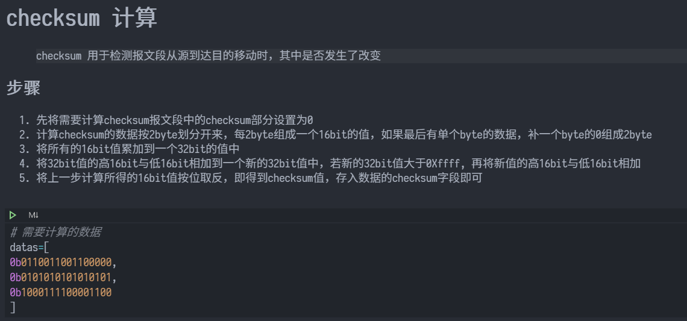
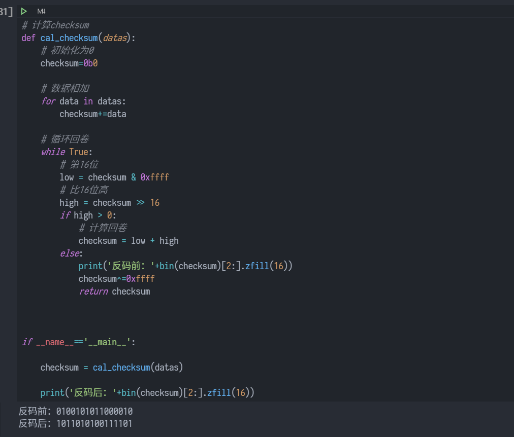
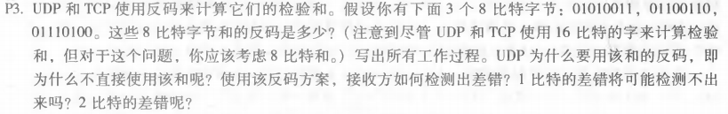
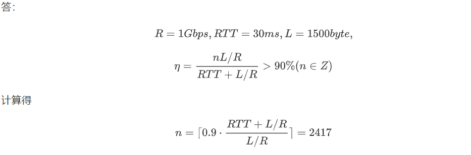

# 课后习题





与书本结果相同

## p3



答：

```
 01010011
+01100110
=10111001
+01110100
=100101101
回卷=00101110
反码=11010001
```

校验时直接将数据相加，如果其中包含0则说明出现差错，检验简单方便。

1比特差错可以检测出

2比特差错不能检测


## p15




---


答：
$$
R = 1 Gbps, RTT = 30 ms, L = 1500byte,
$$

$$
\eta = \frac{n L/R}{RTT+L/R} > 90\%  (n \in Z)
$$

计算得 
$$
n=\lceil 0.9 \cdot \frac{RTT+L/R}{L/R} \rceil = 2417
$$
