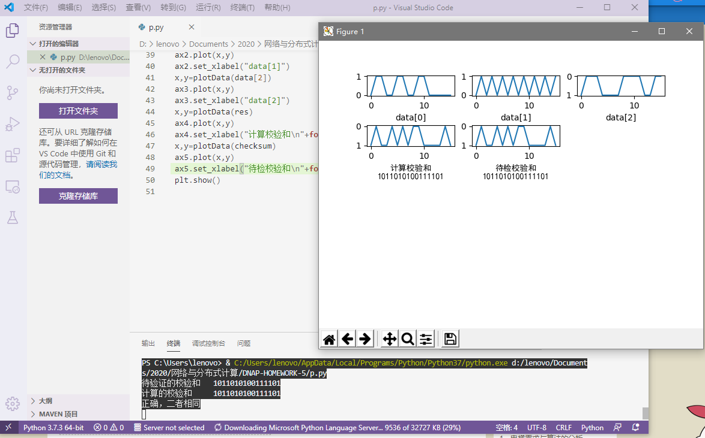
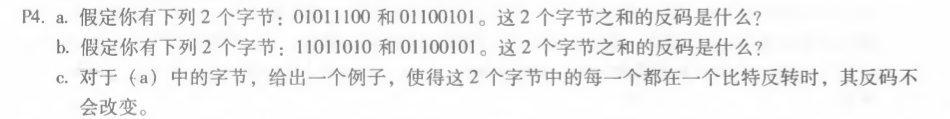
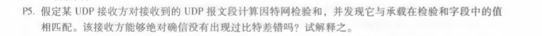

## 校验和程序运行结果
 
## P4
 

1)相加后为11000001，反码为00111110  
2)相加后需要将高位的溢出回卷得到01000000，反码为10111111  
3)前者变为01011101，后者变为01100100，此时二者的变化相互抵消  

## P5

接收方无法确定无差错，如同P4的c问中，两个字节的错误可能会抵消掉二者和中的变化。

 
刘涛 2017302580292 2020.04.01
