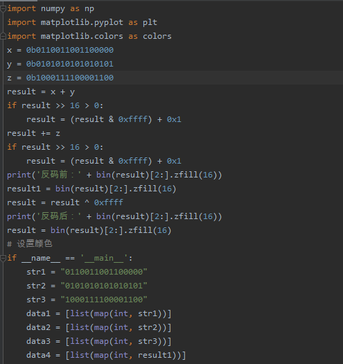
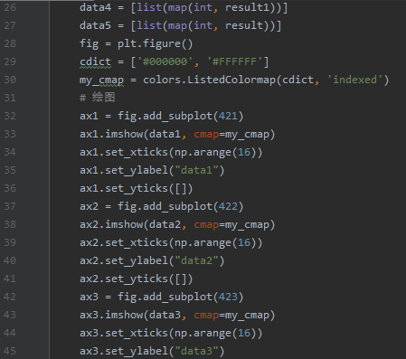
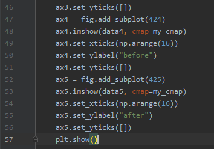
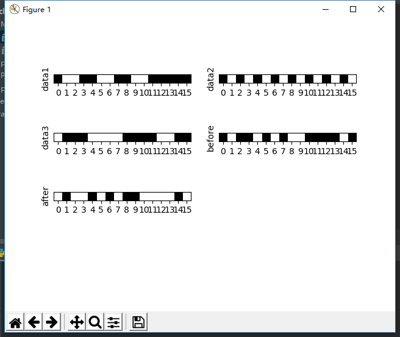
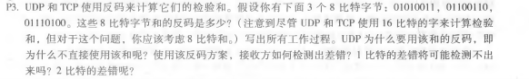
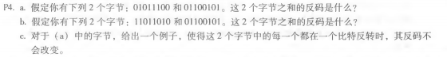

# 第五次作业
## 刘洋 2017302580294
UDPCode: 
 
 
UDP: 
P3: 
&emsp;01010011 
+&nbsp;01100110 
—————— 
=&nbsp;10111001 
+&nbsp;01110100 
—————— 
=&nbsp;00101110 
反码为：11010001 
使用反码可以不依赖系统是大端还是小端，计算检验和都比较简单快速。 
接收方检验差错的方法是将三个字节与检验和相加，如果任何一个位为 0，则说明出错。 
1比特的差错肯定会导致结果不同 
2比特的差错则可能会检测不出，例如题中前两个字节变为：01010010，01100111。 
P4: 
a、 
&emsp;01011100 
+&nbsp;01100101 
—————— 
=&nbsp;11000001 
反码为：00111110 
b、 
&emsp;11011010 
+&nbsp;01100101 
—————— 
=&nbsp;01000000 
反码为：10111111 
c、两个字节变为01011101和01100100 
&emsp;01011101 
+&nbsp;01100100 
—————— 
=&nbsp;11000001 
反码为：00111110 
反码没有改变 