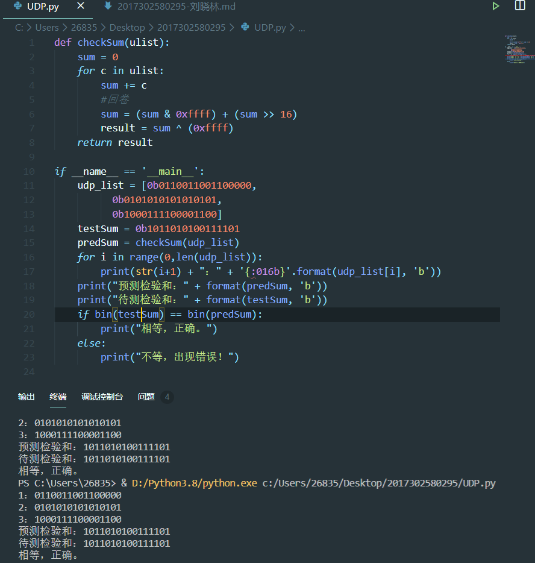

# 作业

## 2017302580295 刘晓林  

### 运行结果 

---

### 习题 P3

>     01010011    
>     01100110   
>     --------  
>     10111001  
>     01110100  
>     --------  
>     00101101  
>            1  
>     -------- 
>     00101110  
> 反码为11010001  
> 优点：不依赖系统是大端小端。  
> 接收方检验差错的方法是将三个字节与检验和相加，如果任何一个位为 0，说明出错
> 1比特的差错一定会导致计算结果不同，而2比特的差错可能无法检测出来，比如P4中c，改变之后字节之和的反码依然不变。

### 习题 P4
> a. 反码为：00111110  
> b. 反码为：10111111  
> c. 两个字节的最后一个比特反转，即01011101，01100100  