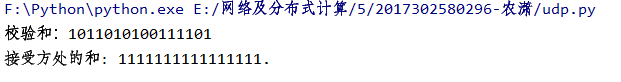

# 网络及分布式计算第四次作业
## 1、python实现udp的16位校验和

## 2、课本第三章习题
### P1
答：假定A向S的源端口号为x，B向S的源端口号为y。
### 
a)A向S的源端口号为x，目的端口号为23。
### 
b)B向S的源端口号为y，目的端口号为23。
### 
c)S向A的源端口号为23，目的端口号为x。
### 
d)S向B的源端口号为23，目的端口号为。
### 
e)x和y可能相同。
### 
f)x和y不可能相同。
### P4
答：a)将两个字节相加得到11000001。取其反码即得00111110。
### 
b)两个字节相加得到01000000；取其反码得到10111111。
### 
c)第一个字节为01010100；第二个字节为01101101。