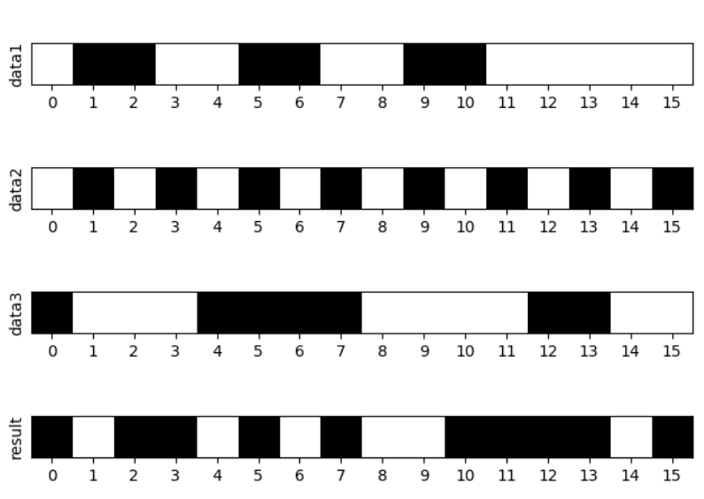
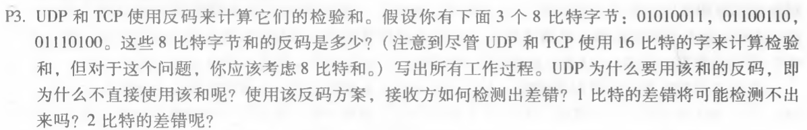
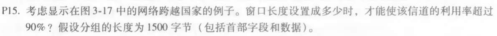

#### 1. UDP 的16位校验和

```python
import numpy as np
import matplotlib.pyplot as plt
import matplotlib.colors as colors


# 设置颜色
def colormap():
    cdict = ['#FFFFFF', '#000000']
    return colors.ListedColormap(cdict, 'indexed')


def checksum(data):
    sum = 0
    index = 0
    while index < len(data):
        a = int(data[index:index + 16], 2)
        sum = int(str(sum),2)
        sum = bin(sum + a)[2:]
        # 求和
        while(len(sum) > 16):
            sum = int(sum, 2) - pow(2, len(sum) - 1)
            sum = bin(sum + 1)[2:]
        index += 16

    result = str(sum)
    # 补零
    while len(result) < 16:
        result = '0' + result

    # 取反
    result = list(result)
    for i in range(len(result)):
        if result[i] == "1" : result[i] = "0"
        elif result[i] == "0" : result[i] = "1"
    result = ''.join(result)
    print("校验和为：" + result)
    return result

if __name__ == '__main__':

    str1 = "0110011001100000"
    str2 = "0101010101010101"
    str3 = "1000111100001100"

    data1 = [list(map(int, str1))]
    data2 = [list(map(int, str2))]
    data3 = [list(map(int, str3))]

    data4 = [list(map(int, checksum(str1 + str2 + str3)))]

    fig = plt.figure()
    my_cmap = colormap()

    # 绘图
    ax1 = fig.add_subplot(411)
    ax1.imshow(data1, cmap=my_cmap)
    ax1.set_xticks(np.arange(16))
    ax1.set_ylabel("data1")
    ax1.set_yticks([])

    ax2 = fig.add_subplot(412)
    ax2.imshow(data2, cmap=my_cmap)
    ax2.set_xticks(np.arange(16))
    ax2.set_ylabel("data2")
    ax2.set_yticks([])

    ax3 = fig.add_subplot(413)
    ax3.imshow(data3, cmap=my_cmap)
    ax3.set_xticks(np.arange(16))
    ax3.set_ylabel("data3")
    ax3.set_yticks([])

    ax4 = fig.add_subplot(414)
    ax4.imshow(data4, cmap=my_cmap)
    ax4.set_xticks(np.arange(16))
    ax4.set_ylabel("result")
    ax4.set_yticks([])

    plt.show()

```

输出结果:

```
校验和为：1011010100111101
```

matplotlib绘图:



#### 2.P3



由 01010011 与 01100110 的和为 10111001，不需要回卷

由 10111001 与 01110100 的和为 100101101，需要回卷，回卷之后得 00101110

再取反得 11010001

使用和的反码 与待校验的码之和全为1 方便判断 

接收方讲校验码与报文段码求和，如果全为1，说明校验通过，如果包含0，校验未通过

1比特的错误一定会检测出来，2比特的错误可能检验不出来 


#### 3. P15



由分组长度为1500字节（12000bit），那么发功一个分组进入链路实际所需时间为
$$
t_{trans} = L/R = \frac{12000bit/pkt}{10^9bit/s} = 12us/pkt
$$
又信道利用率为
$$
U_{sender} = \frac{length * L/R}{RTT + L/R} = \frac{0.012 length}{30.012} >0.9
$$
求得
$$
length > 2451
$$
所以窗口长度至少设置成2451个包大小