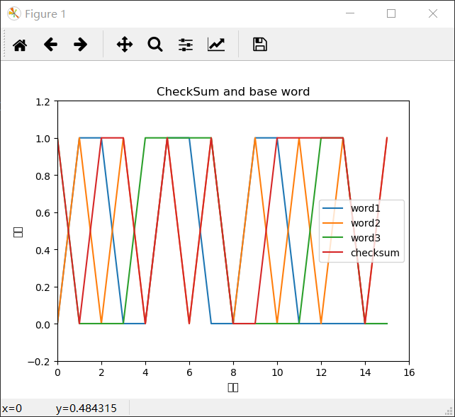

# Homework5
- python实现校验和计算：输入为十六位二进制字符串，默认为课本3.3.2节的计算
  
- P3  
    01010011+01100110=10111001  
    10111001+01110100=100101101 超出
    进行回卷得到00101110，按位取反得到校验和11010001  
    反码好处：不依赖系统是大端还是小端，计算容易
    接受方将收到的三个字节与校验和相加，如果有0则出错  
    1比特的肯定会出错，会被检测到  
    2比特有可能不会被检测到，比如前两个字节变化尾部，只要保证相加结果为10111001都不会被检测到
- P12  
  仅有一个比特差错不影响正常运行，错误后等待重发即可。  
  早超导致现在发送的分组都会重新发送，当N趋于无穷时，第N个分组将被重发无穷次  